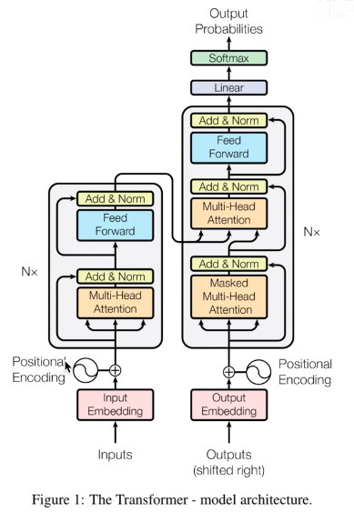
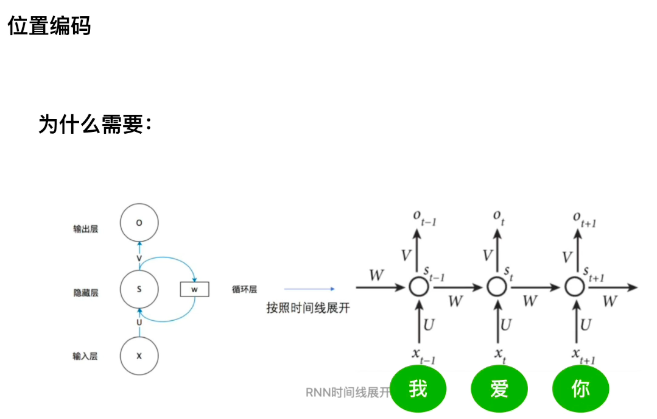
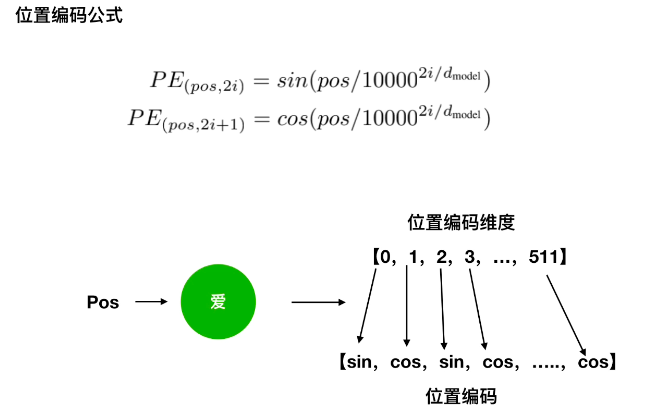
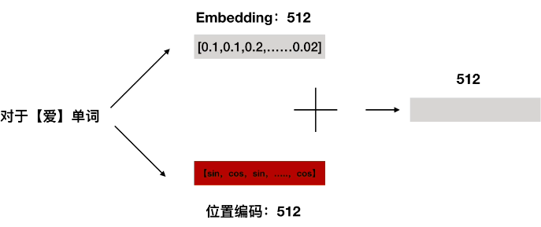
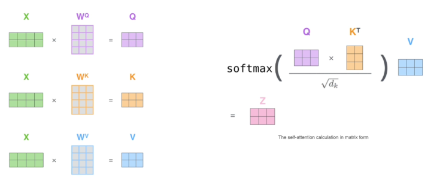
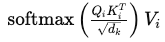
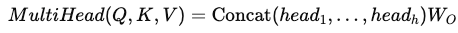
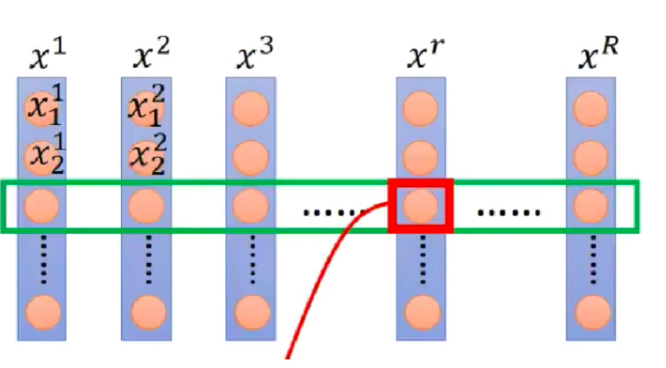
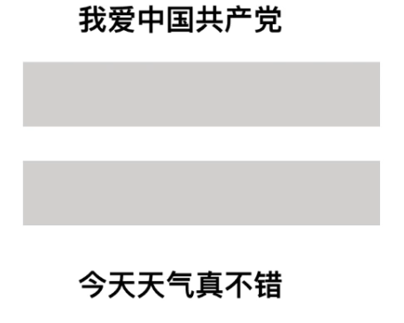

# 1. 位置编码

传统 RNN，天然具备顺序

transformer 通过 multhead attention 实现，但是丢失了顺序，所以要加入位置编码

在 Transformer 结构中，**位置编码（Positional Encoding）** 是一种用于为输入序列中的每个位置（如单词在句子中的顺序）添加位置信息的机制。由于 Transformer 的自注意力机制本身是**排列不变（permutation-invariant）**的（即不关心输入顺序），位置编码帮助模型理解序列中元素的相对或绝对位置。

---

### **位置编码的作用**

1. **补充位置信息**：让模型知道单词的顺序（例如“猫追狗”和“狗追猫”意义不同）。
2. **可泛化到长序列**：即使序列长度超过训练时的最大长度，位置编码也能通过数学规律推断位置。

---

### **位置编码的实现方式**

在原始 Transformer 论文中，位置编码通过正弦和余弦函数生成，公式如下：

$$
PE(pos, 2i) = \sin\left( \frac{pos}{10000^{\frac{2i}{d_{model}}}} \right)
$$

$$
PE(pos, 2i+1) = \cos\left( \frac{pos}{10000^{\frac{2i}{d_{model}}}} \right)
$$

显示 markdown 预览效果

其中：

- $pos$：单词在序列中的位置（从 0 开始）。
- $i$：维度索引（位置编码量的第 $i$ 维）。
- $d_{model}$：模型的隐藏层维度（例如 512）。

这种设计使得位置编码能够：

- 对不同位置生成唯一编码。
- 通过三角函数性质，让模型学习相对位置（如“位置 5”和“位置 6”的编码关系与“位置 10”和“位置 11”类似）。

### **具体例子**

假设我们有一个句子："I love cats"，其词向量维度为`d_model=4`（实际中通常为 512）。我们为每个单词添加位置编码：

1. **输入序列**：["I", "love", "cats"]
   位置：`pos=0`, `pos=1`, `pos=2`
2. **生成位置编码**（简化版，假设`d_model=4`）：
   - 对于`pos=0`（单词"I"）：
     - 第 0 维（`i=0`）：`sin(0 / (10000^(0/4))) = sin(0) = 0`
     - 第 1 维（`i=1`）：`cos(0 / (10000^(2/4))) = cos(0) = 1`
     - 第 2 维（`i=2`）：`sin(0 / (10000^(4/4))) = sin(0) = 0`
     - 第 3 维（`i=3`）：`cos(0 / (10000^(6/4))) ≈ cos(0) = 1`
     - 编码结果：`[0, 1, 0, 1]`
   - 类似地，`pos=1`（"love"）和`pos=2`（"cats"）的编码可能是`[0.84, 0.54, 0.01, 1]`和`[0.91, -0.42, 0.02, 0.99]`（实际值由计算得出）。
3. **最终输入**：词向量 + 位置编码
   - "I"的词向量假设是`[0.5, 0.1, -0.2, 0.3]`，加上位置编码后：
     `[0.5+0, 0.1+1, -0.2+0, 0.3+1] = [0.5, 1.1, -0.2, 1.3]`

### **为什么不用简单的位置序号？**

- 直接使用`0,1,2,...`会导致数值过大，干扰词向量（尤其是长序列）。
- 三角函数编码可以扩展到任意长度的序列，并保留相对位置关系。

## 1.1 **为什么使用 sin 与 cos 交替?**

## 一、位置编码的完整计算式（以原始 Transformer 为例）

设定模型维度为 $d_{model}$，即嵌入（word embedding）和位置编码都是这个维度，比如 512，768 等。

对于任意位置 $pos$ 和维度索引 $i \in [0, d_{model})$，其位置编码为：

$$
PE(pos, 2i) = \sin\left(\frac{pos}{10000^{\frac{2i}{d_{model}}}}\right)
$$

$$
PE(pos, 2i+1) = \cos\left(\frac{pos}{10000^{\frac{2i}{d_{model}}}}\right)
$$

注意：$\sin$ 和 $\cos$ 使用的是相同的分母，频率一致，但在两个维度上分别编码。

---

## 二、为什么不丢失 $2i+1$ 的信息

你可能是这样理解的：

既然 cos 的频率参数是由 $2i$ 来控制的，那“$2i+1$”好像没有参与编码计算？

但实际上：

- $2i$ 是频率编码：用来控制这个 $(\sin, \cos)$ 的频率（角度）
- $2i$ 和 $2i+1$ 是位置编码向量中的不同维度
    - 第 $2i$ 维使用 $\sin$
    - 第 $2i+1$ 维使用 $\cos$

所以，$2i+1$ 并不是“用 $2i$ 对其编码”，而是与 $2i$ 配合，共同编码频率

也就是说，每对维度（sin, cos）共享同一频率，在两个维度上表达这个位置在这个频率下的状态，不是丢失，而是不同表示。

### **多尺度感知 —— 多频率组合帮助模型理解长短依赖**

通过使用不同频率的 sin 和 cos，在编码中混合了：

- 高频（变化快）：表达**局部、短距离**的位置信息
- 低频（变化慢）：表达**全局、长距离**的位置信息

这样可以让 Transformer 同时感知词与词之间的短依赖和长依赖关系。

## 比较：向量的极坐标表示

一个频率 $f$ 对应的位置信息可以写作：

$$
\left[\sin(f \cdot pos), \cos(f \cdot pos)\right] = \text{一个在单位圆上转动的向量}
$$

这个向量一方面表示了当前位置 $pos$ 在该频率下的状态。

- $\sin(f \cdot pos)$：是这个向量在 $y$ 方向的投影
- $\cos(f \cdot pos)$：是 $x$ 方向的投影

利用这两个值合起来一起表示了完整的位置信息。

对任意两个位置 pos1 和 pos2，你会发现使用交替的 sin 和 cos 编码后，它们之间的点积或差值具有可预测的形式：

$$
\sin(a) \cos(b) - \cos(a) \sin(b) = \sin(a - b)
$$

---

**借助上面公式，可以得到一个特定位置的 $d_{model}$ 维度的位置信量，并且借助三角函数的性质：**

$$
\left\{
\begin{array}{l}
\sin(\alpha + \beta) = \sin\alpha \cdot \cos\beta + \cos\alpha \cdot \sin\beta \\
\cos(\alpha + \beta) = \cos\alpha \cdot \cos\beta - \sin\alpha \cdot \sin\beta
\end{array}
\right.
$$

---

**可以得到：**
$$
\begin{aligned}
PE(pos + k, 2i) &= PE(pos, 2i) \times PE(k, 2i) + PE(pos, 2i + 1) \times PE(k, 2i + 1) \\
PE(pos + k, 2i + 1) &= PE(pos, 2i + 1) \times PE(k, 2i) + PE(pos, 2i) \times PE(k, 2i + 1) - PE(pos, 2i) \times PE(k, 2i)
\end{aligned}
$$

可以看出，对于 $pos+k$ 位置的位置信息是 $2i$ 或 $2i+1$ 而言，可以表示为，pos 位置与 $k$ 位置信息的位置信量的 $2i$ 与 $2i+1$ 维度组合，这样的线性组合会携带着位置向量中蕴含了相对位置的信号。

这种关系意味着 Transformer 可以**轻易地计算两个位置之间的相对距离**，这对理解“谁离谁更近”很重要。

## 1. 每一对维度（$2i$, $2i+1$）共用一个频率

对于每个频率 $f_i = \frac{1}{10000^{\frac{2i}{d}}}$，你有两个分量：

- $\sin(f_i \cdot pos) \rightarrow$ 放在第 $2i$ 维
- $\cos(f_i \cdot pos) \rightarrow$ 放在第 $2i+1$ 维

这样来，维度数是 $d$，频率数是 $\frac{d}{2}$。

---

## 2. 为什么这样设计？

这是一个经典的信号编码技巧：

- 类似于傅里叶变换中，频率的正弦与余弦分量可以唯一地表示一个相位。
- 把 $\sin(x)$ 和 $\cos(x)$ 组合，就相当于一个二维单位圆的旋转量。

每个频率使用两个维度（sin + cos）能：

- 捕捉该频率下的位置特征
- 确保模型可以通过这些特征学习到相对位置

# 2.注意力机制

**head =** 

## 2.1 最早的注意力机制是什么？当时处于什么目的提出来的？

最早的注意力机制可以追溯到 2014-2015 年，其开创性工作主要集中在**神经机器翻译（Neural Machine Translation, NMT）**领域。

- **代表性工作：**

  - **Bahdanau, Cho, Bengio (2014):** "Neural Machine Translation by Jointly Learning to Align and Translate"
  - **Luong, Pham, Manning (2015):** "Effective Approaches to Attention-based Neural Machine Translation"

- **当时处于什么目的提出来的？**

  在注意力机制出现之前，主流的 NMT 模型是基于编码器-解码器（Encoder-Decoder）架构的循环神经网络（RNN），通常是长短期记忆网络（LSTM）或门控循环单元（GRU）。这些模型面临的主要挑战是：

  1. **信息瓶颈（Information Bottleneck）：** 编码器需要将整个源语句压缩成一个固定长度的“上下文向量”（context vector）。当源语句很长时，这个固定长度的向量很难完整地编码所有必要的信息，导致长句翻译质量下降。模型往往会“忘记”源语句开头的信息。
     - **问题：** 类似于你把一本厚厚的书的内容全部塞进一个小小的 U 盘，很容易丢失信息。
  2. **长期依赖问题：** 传统 RNN 在处理长序列时，梯度可能会消失或爆炸，导致模型难以学习到相距较远词之间的依赖关系。

  **注意力机制的提出正是为了解决这两个核心问题。**

  - **解决信息瓶颈：** 注意力机制允许解码器在生成目标序列的每个词时，不必仅仅依赖于一个单一的、固定长度的上下文向量。相反，它能够动态地“关注”源语句中与当前目标词最相关的部分。
    - **类比：** 想象一个人工翻译者，在翻译句子时，他不会一次性记住整个句子，而是在翻译当前词时，会回过头去看源句中哪些词是相关的。注意力机制就是模拟了这种“选择性关注”的过程。
  - **解决长期依赖问题：** 通过允许解码器直接访问编码器中不同时间步的隐藏状态（作为 K 和 V），注意力机制为模型提供了一个跳跃式连接，从而避免了信息必须通过序列逐步传递的限制。这使得模型更容易捕捉到源序列中的长距离依赖。

## 2.2 普通的注意力机制 Attention Mechanism

注意力机制最早是在机器翻译领域提出的，目的是解决传统序列模型（如 RNN）在处理长序列时信息瓶颈和长期依赖的问题。它允许模型在处理序列的某个元素时，能够“关注”输入序列中所有或部分相关的元素。

- **原理**：注意力机制可以被概括为：给定一个查询（query）向量，去查询一系列键（key）向量，并根据查询与键的相似度，对相应的值（value）向量进行加权求和，从而得到一个加权的上下文向量。

  $$
  \text{Attention}(Q, K, V) = \text{softmax} \left( \frac{QK^T}{\sqrt{d_k}} \right)V
  $$

  这个公式被称为“缩放点积注意力”（Scaled Dot-Product Attention）。

---

**Q（Query）、K（Key）、V（Value）的原理**

- **Q（Query） - 查询**：代表当前需要处理的信息或要查询的目标。你可以把它理解为图书馆里你手上的“书名”或“搜索请求”。
- **K（Key） - 键**：代表可以被查询的信息。你可以把它理解为图书馆里每本书的“索引”或“关键词”。
- **V（Value） - 值**：代表与键相关联的实际信息内容。你可以把它理解为图书馆里每本书的“实际内容”。

---

**为什么 Q 与 K 直接计算出分数了，为什么还要 V？**

Q 和 K 的目的是计算“注意力分数”，也就是确定每个位置的“重要性”或“相关性”。但是，这些分数本身并不包含实际的信息内容。V 才是真正的信息载体。

所以，Q 和 K 用于确定“关注哪里”，而 V 提供“关注了什么”。缺少 V，注意力机制就无法提供实际的信息输出。

---

## 2.3 Transformer 中 Q、K、V 是否一样?

**Transformer 中 Q、K、V 是否一样？**

在 Transformer 模型中，Q、K、V 在概念上是不同的，但在实现上，它们最初都来自于相同的输入序列。

- **编码器（Encoder）中的自注意力：**
  - 在编码器的每个自注意力层中，Q、K、V 都来自于同一个输入序列（例如，某个输入句子的词嵌入）。这意味着每个词都会查询所有其他词，从而捕捉整个句子内部的依赖关系。在这种情况下，尽管它们来自相同的输入，但 Q、K、V 会通过不同的线性变换矩阵$W_Q, W_K, W_V$投影到不同的表示空间。$$ Q=XW_Q \quad K = XW_K \quad V=XW_V$$ 其中$X$是输入序列的表示。
- **解码器（Decoder）中的自注意力：**
  - 与编码器类似，解码器中的自注意力也从其自身的输入序列（已生成的词）生成 Q、K、V。
- **解码器中的编码器-解码器注意力（Cross-Attention）：**
  - 这是 Transformer 中 Q、K、V 来源不同的地方。
    - **Q (Query)** 来自于解码器的前一个输出（即当前要生成的词的表示）。
    - **K (Key)** 和 **V (Value)** 来自于编码器的最终输出。
  - 这种设计使得**decoder**在生成目标序列的每个词时，能够“关注”到输入序列（源语言）中所有相关的词。 $$ Q=YW*Q \quad K=X*{enc}W*K \quad V= X*{enc} W $$其中$Y$是解码器当前部分的输入，$X\_{enc}$是编码器的输出。

## 2.4 自注意力（Self-Attention）是什么？

**自注意力（Self-Attention）是什么？**

自注意力是注意力机制的一种特殊形式，其中 Q、K、V 都来源于同一个序列。换句话说，模型在处理序列中的一个元素时，能够关注到序列中所有其他元素（包括它自己）。

- **原理：** 对于一个输入序列$X = (x_1, x_2, \dots, x_n)$，自注意力为序列中的每一个元素$x_i$计算一个输出表示$y_i$。在计算$y_i$时，它会综合考虑$x_i$与序列中所有其他元素$x_j$之间的关系。 具体地，对于序列中的每个位置$i$：

  1. $x_i$作为查询 Q。
  2. 序列中所有的$x_j$作为键 K 和值 V。
  3. 计算$x_i$与所有$x_j$的相似度，得到权重。
  4. 用这些权重对所有$x_j$的值进行加权求和，得到$y_i$。

  数学公式与普通注意力相同，只是 Q、K、V 都来自于相同的输入序列经线性变换。

$$
\text{Attention}(XW_Q, XW_K, XW_V) = \text{softmax} \left( \frac{XW_Q (XW_K)^T}{\sqrt{d_k}} \right) XW_V
$$

- **好处：**

  1. **捕捉长距离依赖：** 传统 RNNs 需要通过序列逐步传递信息，可能存在长期依赖问题。自注意力机制允许任何两个位置之间的信息直接交互，无论它们在序列中的距离有多远。这使得模型能够更好地捕捉句子中的长距离依赖关系。
     - **例子：** 在句子“The animal didn't cross the street because it was too tired.”中，"it"指向"animal"。自注意力可以直接将"it"和"animal"关联起来，而无需通过中间词逐层传递信息。
  2. **并行计算：** 由于每个词的注意力计算可以独立进行，自注意力机制可以高度并行化，这极大地加速了模型的训练过程，尤其是在 GPU 等并行计算硬件上。这是 Transformer 模型能够处理长序列的关键之一。
  3. **捕获全局信息：** 每个词的表示都包含了整个序列的信息，因为它与其他所有词都进行了交互。这使得模型能够生成更丰富、更具上下文意义的表示。
  4. **对语序不敏感（结合位置编码）：** 纯粹的自注意力机制是置换不变的，这意味着如果打乱输入序列的顺序，其输出也会以同样的方式打乱。为了解决这个问题，Transformer 引入了“位置编码”（Positional Encoding），将序列中词的位置信息融入到词的嵌入中，从而使模型能够感知词的顺序。

- **为什么可以达到这样的效果？**

  - **直接连接：** 自注意力打破了传统序列模型（如 RNN）的链式结构，使得序列中的任意两个位置之间都存在一条直接的路径。这种“全连接”的特性使得信息传播更加高效。
  - **权重学习：** 注意力权重是模型通过训练数据学习到的，这意味着模型可以根据任务和上下文的需要，动态地分配不同位置的重要性。
  - **矩阵运算：** 所有的 QKV 计算、点积和加权求和都可以表示为高效的矩阵乘法，这非常适合现代深度学习框架和硬件的优化。

# 3.LayerNorm

|  |  |
| ----------------------------------------------------------------------------------------------------------------------------- | ----------------------------------------------------------------------------------------------------------------------------- |

上图是 BatchNorm，按照维度去进行 norm，这在 NLP 中有两个问题：

- 1.句子长度不一样
- 2.例子中 两句话中 **我** 与 **今** 表示的特征肯定不一样，所以不能做 norm。

## 3.1. **核心思想对比**

- **BatchNorm**：对同一特征维度（channel）跨样本（batch）进行归一化，依赖 batch 统计量（均值/方差）。
  - 公式：对每个特征维度 $j$，计算 batch 内所有样本的均值和方差：

    $$
    \mu_j = \frac{1}{B} \sum_{i=1}^{B} x_{ij}, \quad
    \sigma_j^2 = \frac{1}{B} \sum_{i=1}^{B} (x_{ij} - \mu_j)^2
    $$

    $$
    \text{归一化：} \quad \hat{x}_{ij} = \frac{x_{ij} - \mu_j}{\sqrt{\sigma_j^2 + \epsilon}}
    $$

    $$
    \text{最终输出：} \quad y_{ij} = \gamma_j \hat{x}_{ij} + \beta_j \quad \text{（可学习的缩放和平移参数）}
    $$

---

- **LayerNorm**：对单个样本的所有特征维度进行归一化，不依赖 batch。
  - 公式：对每个样本 $i$，计算其所有特征的均值和方差：

    $$
    \mu_i = \frac{1}{d} \sum_{j=1}^{d} x_{ij}, \quad
    \sigma_i^2 = \frac{1}{d} \sum_{j=1}^{d} (x_{ij} - \mu_i)^2
    $$

    $$
    \text{归一化：} \quad \hat{x}_{ij} = \frac{x_{ij} - \mu_i}{\sqrt{\sigma_i^2 + \epsilon}}
    $$

    $$
    \text{最终输出：} \quad y_{ij} = \gamma_j \hat{x}_{ij} + \beta_j \quad \text{（同样有可学习参数）}
    $$

  - 在 RNN/Transformer 中，序列长度可变，BatchNorm 难以对齐不同长度的样本。LayerNorm 对每个时间步独立归一化，更适合序列模型。
