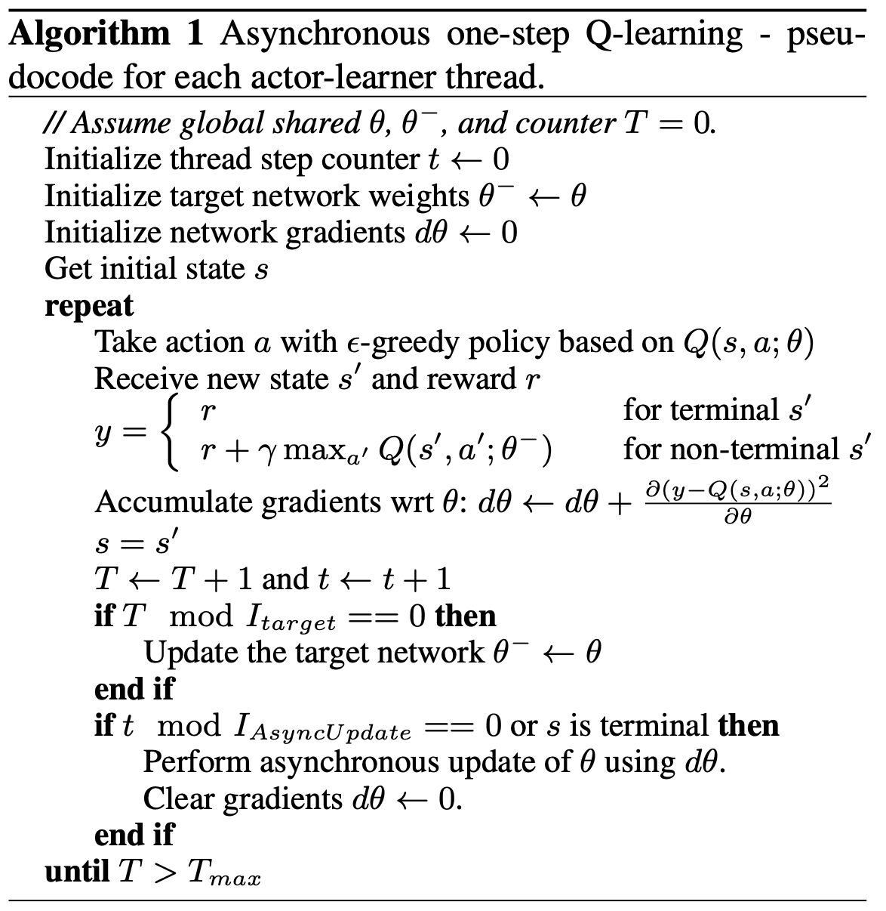
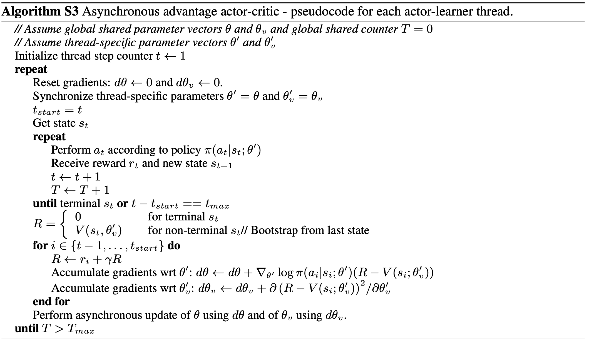

# 3. A3C (Asynchronous Advantage Actor-Critic)

**论文**：Asynchronous Methods for Deep Reinforcement Learning  https://arxiv.org/pdf/1602.01783

提高训练效率：通过多个并行的工作进程（workers）异步更新全局模型，充分利用多核 CPU，减少训练时间。

减少样本相关性：异步并行采集数据可以打破序列数据的相关性，类似经验回放的效果，但无需额外存储。

## 3.1 算法过程

### 3.1.1 异步多进程 Qlearning（初）

**t**：线程步计数器 

- 记录**当前线程内部**的动作执行步数（即该线程独立探索环境的次数）。
- 每次线程执行一个动作（`Take action a`）后，`t` 增加1。
- 控制线程内部的**梯度更新频率**（如每 $I_{AsyncUpdate}$ 步更新一次主网络参数 `θ`）。

**T**：全局计数器

- 记录**所有线程累计**的总步数（即全局的动作执行次数）。
- 任何线程执行一个动作后，`T` 增加1（所有线程共享同一个 `T`）。
- 控制**目标网络 `θ⁻` 的同步频率**（如每 $I_{target}$ 步同步一次 `θ⁻=θ`）。
- 若线程A和线程B共执行了100步，则 `T=100。

**异步性**：多个线程并行探索时，需独立记录各自的进度（`t`），同时全局监控整体训练量（`T`）

**梯度更新**：当 $$t\%I_{AsyncUpdate} == 0$$ 时，线程用累积的梯度 `dθ` 更新主网络 `θ`。

- **目标网络同步**：当 $$T\% I_{target} == 0$$ 时，所有线程停止并同步 `θ⁻=θ`。
- **终止条件**：主进程检查 $T > T_{max}$ 时终止所有线程

--------

## 3.2 A3C（引出）

在**A3C（Asynchronous Advantage Actor-Critic）**算法中，**熵正则化（Entropy Regularization）**是一个重要的技术，用于提升强化学习策略的探索能力并防止过早收敛到次优解。以下详细解释熵正则化的作用、为何需要减去熵项，以及其背后的原理，适合研究生或技术开发人员理解。另外，通过多线程并行执行来加速训练，显著提高了学习效率。

### 3.2.1 算法过程

 

### 3.2.2 公式

**策略更新（Actor）**
策略参数的梯度更新公式：
$$
\nabla_{\theta'}\log\pi(a_t|s_t; \theta') \cdot A(s_t,a_t;\theta,\theta_v)
$$

**优势函数估计（Advantage）**
n步优势函数计算：
$$
A(s_t,a_t;\theta,\theta_v) = \sum_{i=0}^{k-1} \gamma^i r_{t+i} + \gamma^k V(s_{t+k}; \theta_v) - V(s_t; \theta_v)
$$

- $k$：从当前状态$s_t$开始的实际步数（$k \leq t_{max}$）
- $\gamma$：折扣因子

**带熵正则化的目标函数梯度**
$$
\nabla_{\theta'}\log\pi(a_t|s_t;\theta')(R_t - V(s_t;\theta_v)) + \beta\nabla_{\theta'}H(\pi(s_t;\theta'))
$$

- $H$ 是策略熵
- $\beta$ 是熵正则化系数

**6. 目标函数分解**
A3C的总目标是最大化：
$$ J(\theta)=\mathbb{E}[R(\tau)]+\beta\cdot H(\pi) $$

- $\mathbb{E}[R(\tau)]$：期望回报（需最大化）
- $H(\pi)$：策略熵（需最大化）

**7. RMSProp 优化器更新公式**
$$
\begin{aligned}
g &= \alpha g + (1-\alpha)\Delta\theta^2 \\
\theta &\leftarrow \theta - \eta\frac{\Delta\theta}{\sqrt{g+\epsilon}}
\end{aligned}
$$

- $\alpha$: 衰减率

- $\eta$: 学习率

- $\epsilon$: 小常数（防止除零）

  

### 3.2.3 熵正则化的作用

熵正则化通过在损失函数中引入策略的熵项，鼓励策略保持一定的随机性，从而实现以下目标：

**1.增强探索（Exploration）：**

在强化学习中，智能体需要平衡探索（exploration）和利用（exploitation）。如果策略过于确定性地选择某一动作（即策略分布过于尖锐），可能会错过潜在的更好动作，导致陷入局部最优。

熵正则化通过**鼓励策略分布具有更高的熵（即更均匀的概率分布），增加智能体尝试不同动作的可能性，从而促进探索。**

**2.防止过早收敛：**
在训练初期，策略网络可能快速收敛到一个次优策略（例如总是选择某个动作）。熵正则化通过惩罚过于确定的策略分布，防止策略过早收敛，保持学习过程中的多样性。

**3.提高训练稳定性：**
高熵的策略分布可以平滑策略更新，降低策略梯度更新的方差，从而提高训练的稳定性。

**4.为什么在损失函数中减去熵项？**
$L(θ)=−E[logπ_θ(a_t∣s_t)A(s_t,a_t)]−βH(π_θ(s_t))$

   - $H(π_θ(s_t))=−∑_aπ_θ(a∣s_t)logπ_θ(a∣s_t)$：策略在状态 $s_t$ 下的熵，衡量策略的随机性。
   - $β$：熵正则化的权重，控制熵项的影响。
     熵越大，策略越随机（分布越均匀）；熵越小，策略越确定（分布越尖锐）。

**损失函数优化方向**：在优化过程中，通常通过**最小化**损失函数 $L(θ)$来更新参数$θ$。为了最大化熵 $H(π_θ(s_t))$，需要在损失函数中减去熵项（即 $−βH(π_θ(s_t))$，因为：**负号确保梯度更新方向鼓励更高的熵。**

**5.实际效果**：

- 假设某状态下初始策略分布为 $πθ(a∣s_t)=[0.9,0.05,0.05]$（过于确定），熵较低。
- 熵正则化通过 $−βH(π_θ(s_t))$ 惩罚低熵分布，梯度更新会使分布更均匀，例如趋向 [0.4,0.3,0.3][0.4, 0.3, 0.3][0.4,0.3,0.3]，从而鼓励尝试其他动作。

**权衡参数 $β$**：

- $β$ 控制熵正则化的强度：
  - $β$ 过大：策略过于随机，可能无法有效利用已有知识。
  - $β$ 过小：策略过于确定，可能陷入局部最优。

## 3.3 A2C

A2C是A3C的同步变体，未单独发表论文，但A2C的实现和讨论出现在OpenAI的后续博客和代码库（如OpenAI Baselines）中，基于A3C的理论框架。

A2C（Advantage Actor-Critic）是Actor-Critic方法的改进版本，旨在解决以下问题：

高方差问题：传统策略梯度方法（如REINFORCE）的梯度估计方差较大，导致训练不稳定。

并行化需求：深度强化学习需要大量样本，单线程采样效率低，限制了算法的扩展性。

计算效率：早期的Actor-Critic方法（如异步优势Actor-Critic, A3C）依赖异步更新，增加了实现复杂度和对硬件的依赖。

### 3.3.1 对比A3C

| 特性             | A3C (Asynchronous Advantage Actor-Critic)            | A2C (Advantage Actor-Critic)           |
| ---------------- | ---------------------------------------------------- | -------------------------------------- |
| **并行机制**     | 完全异步：多个worker独立与环境交互，随时更新全局网络 | 同步：所有worker并行执行N步后统一更新  |
| **梯度更新**     | 异步更新：各worker计算梯度后立即覆盖全局参数         | 同步更新：聚合所有worker梯度后平均更新 |
| **计算效率**     | 可能因异步更新产生冲突，但资源利用率高               | 无参数冲突，但需要等待最慢的worker完成 |
| **策略一致性**   | 各worker策略版本不一致（"延迟策略"问题）             | 始终保持策略同步                       |
| **实现复杂度**   | 需要处理线程间竞争（如全局参数锁）                   | 实现更简单（类似批处理）               |
| **样本利用率**   | 可能因策略不一致降低样本效率                         | 同步机制保证样本一致性                 |
| **典型应用场景** | 需要快速探索的环境（如Atari游戏）                    | 对策略一致性要求高的任务（如连续控制） |

### 3.3.2 A3C与A2C的价值函数损失对比

#### 3.3.2.1 基础形式相同
两者的价值函数损失都采用**均方误差（MSE）**：
$$
L_V = \mathbb{E} \left[ (R_t - V(s_t))^2 \right]
$$
其中：
- $R_t$ 为实际回报（n-step或GAE估计）
- $V(s_t)$ 为价值网络预测值

#### 3.3.2.2 关键差异点

| **特性**       | **A2C**                 | **A3C**                      |
| -------------- | ----------------------- | ---------------------------- |
| **回报估计**   | 多用GAE（广义优势估计） | 多用n-step回报               |
| **更新稳定性** | 同步更新使梯度更稳定    | 异步更新可能导致价值估计波动 |
| **探索辅助**   | 通常不显式依赖熵正则    | 常需熵正则补偿异步策略差异   |

#### 3.3.2.3 数学形式差异
**A2C的典型回报计算（GAE）**：
$$
A^{\text{GAE}} = \sum_{l=0}^{k-1} (\gamma \lambda)^l \delta_{t+l}, \quad \delta_t = r_t + \gamma V(s_{t+1}) - V(s_t)
$$

**A3C的典型回报计算（n-step）**：
$$
R_t^{\text{n-step}} = \sum_{l=0}^{n-1} \gamma^l r_{t+l} + \gamma^n V(s_{t+n})
$$

#### 3.3.2.5 A2C未强制使用熵正则的原因

**同步更新的稳定性**

- A2C的同步更新机制(所有环境步调一致)本身比A3C的异步更新更稳定，探索效率的依赖度较低。
- A3C因异步线程的策略版本差异("延迟策略"问题)，需额外熵正则来弥补探索不足，而A2C无此需求。

**探索与优化的权衡**
- A2C通常搭配GAE(Generalized Advantage Estimation)，其多步优势估计已能提供足够的探索信号。
- 若环境本身探索难度低(如连续控制任务)，熵正则可能成为冗余。

**实现简洁性**
- A2C的设计初衷是简化A3C的异步复杂性，去掉熵正则可减少超参数(如β)的调优成本。

**何时需要在A2C中加熵?**
以下情况建议添加熵正则：
- **高维/稀疏奖励环境**：如Atari游戏、部分机器人控制任务。
- **策略易收敛到次优解**：若发现Agent过早固定动作分布。
- **参考现代变体**：如SAC(Soft Actor-Critic)将熵最大化作为核心目标。

#### 3.3.2.5 实验影响

  - 在连续控制任务（如MuJoCo）中，两者差异较小
  - 在离散动作空间（如Atari）中，A3C因n-step估计和异步更新可能需更小的学习率

  

  

