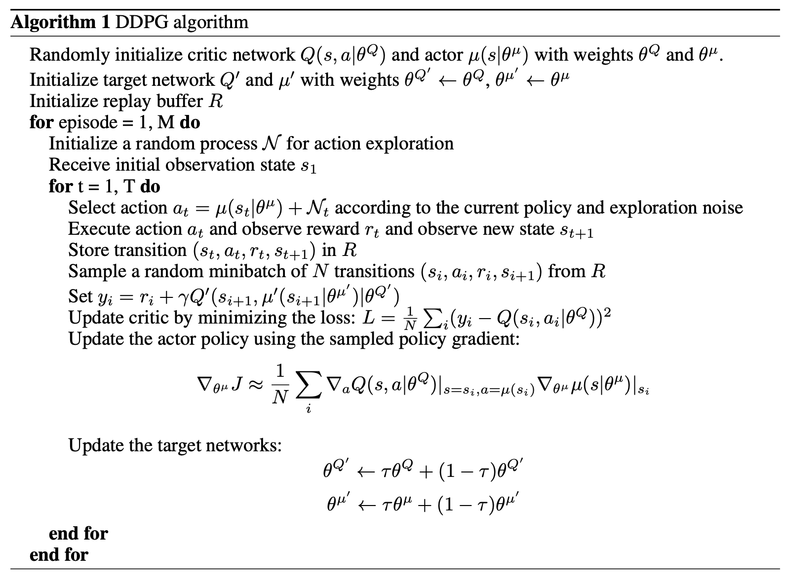

# 4. DDPG (Deep Deterministic Policy Gradient)

论文：Continuous control with deep reinforcement learning

https://arxiv.org/pdf/1509.02971

结合了深度学习技术，使得Actor-Critic方法能够处理高维连续动作空间。

**DDPG基于的算法：**
 DDPG是基于**DPG（Deterministic Policy Gradient, 确定性策略梯度）**算法的改进。DPG由Silver等人在2014年提出，是一种结合了策略梯度（Policy Gradient）和值函数（Value Function）的强化学习方法，旨在处理连续动作空间问题。DPG的核心思想是通过确定性策略（deterministic policy）直接输出动作，而不是像传统的策略梯度方法（如REINFORCE）那样输出动作的概率分布。

**主要解决的问题：**
 传统策略梯度方法（如REINFORCE）主要针对**离散动作空间**，在连续动作空间中需要对动作分布进行采样，计算复杂度高且效率低下。此外，Q-learning等基于值函数的方法在连续动作空间中需要对动作空间进行离散化或最大化操作，这在高维连续空间中不切实际。DPG通过引入确定性策略解决了这个问题，但其本身未结合深度神经网络，难以处理高维状态或复杂的环境。

**DDPG如何解决这些问题：**
 DDPG通过结合**深度神经网络（DQN的成功经验）\**和\**DPG的确定性策略梯度**，解决了以下问题：

1. **连续动作空间的高效处理**：DDPG使用确定性策略直接输出动作，避免了动作概率分布的采样问题。
2. **高维状态的处理**：通过深度神经网络（Actor和Critic网络）建模策略和值函数，能够处理复杂的环境和状态。
3. **探索问题**：DDPG引入了**噪声机制**（如Ornstein-Uhlenbeck噪声）来增强探索能力，避免策略陷入局部最优。
4. **稳定性问题**：借鉴DQN的经验回放（Replay Buffer）和目标网络（Target Network），提高了训练的稳定性。

## 4.1算法过程

 

- $μ(s∣θ^μ)$直接输出确定性动作值

- 对比分析：不同于传统策略梯度方法（如REINFORCE）输出概率分布$π(a∣s)$需要采样

- 示例：机械臂控制中，网络直接输出关节力矩值（如2.37Nm），而非选择离散动作（如"大/中/小"力度）

  - 策略网络输出的原始动作

  - $N_t$: 时间相关的连续噪声（通常采用Ornstein-Uhlenbeck过程）

## 4.2 动作噪音

**OU噪声的数学定义**
$$ dN_{t} = \theta(\mu - N_{t})dt + \sigma dW_{t} $$

**动作生成公式**
$$ a_{t} = \mu(s_{t}|\theta^{\mu}) + N_{t} $$

- $\mu(s_{t}|\theta^{\mu})$：确定性策略网络输出的原始动作
- $N_{t}$：Ornstein-Uhlenbeck过程生成的连续噪声

**自动驾驶转向控制**

- 策略输出：方向盘角度$μ(s_t)=0.8rad$（右转）
- OU噪声：$N_t=0.05sin(0.1t)$（时间相关的波动）
- 实际执行：$a_t∈[0.75,0.85]rad$范围内平滑变化

### 4.2.1 加入噪音的原因

**1.突破局部最优**

- **问题场景**：若策略始终输出固定动作a=0.6，可能错过附近更优解a=0.65

**2.适配物理系统连续性**

- 机械系统惯性要求动作连续（如电机扭矩不能突变）

**3.平衡探索-利用矛盾**

- 初期：大噪声（如σ=0.3）广泛搜索
- 后期：小噪声（σ=0.01）精细调优

### 4.2.2与离散噪声的对比

| 特性       | OU连续噪声          | $\epsilon$-greedy离散噪声 |
| ---------- | ------------------- | ------------------------- |
| 动作变化   | 微小扰动（如±0.02） | 硬切换（50%完全随机）     |
| 时间相关性 | 具有马尔可夫性      | 独立随机                  |
| 物理适用性 | 适合惯性系统        | 可能导致动作突变          |

## 4.3 权重τ的soft update参数

在DDPG算法中，目标网络参数的更新确实采用了带有权重$\tau$的软更新(soft update)方式，而不是常规的梯度下降更新。这种设计是DDPG算法的关键特性之一，主要基于以下原因：

1. **稳定性考量**：
   - 直接硬更新（即完全替换目标网络参数$\theta' \leftarrow \theta$）会导致目标值的剧烈变化，容易引发训练不稳定。
   - 软更新通过$\tau$（通常取接近0的值如0.01）实现参数的渐进式更新，使目标网络的变化更平滑。

2. **目标网络的作用**：
   - 目标网络$Q'$和$\mu'$用于计算TD目标$y_i = r_i + \gamma Q'(s_{i+1}, \mu'(s_{i+1}))$。
   - 如果目标网络参数频繁大幅变化，会导致TD目标值抖动（类似移动的目标问题），进而影响Critic网络的收敛。

3. **数学表达**：
   - 更新公式$\theta' \leftarrow \tau\theta + (1-\tau)\theta'$是指数移动平均的一种形式。
   - 当$\tau \ll 1$时，目标网络参数会缓慢跟踪当前网络参数，相当于对当前网络参数做了低通滤波。

4. **与DQN的区别**：
   - DQN采用周期性硬更新（每隔C步完全同步参数），而DDPG采用每一步软更新。
   - 实验表明软更新在连续控制任务中通常表现更稳定。

这种设计是深度强化学习中解决"训练不稳定性"的经典方法之一，后来也被TD3等改进算法继承。权重$\tau$成为需要调参的超参数，通常取0.001到0.01之间。

## 4.4 DDPG的算法公式

DDPG的算法公式主要涉及以下几个部分：Actor网络、Critic网络、目标函数和梯度更新规则。

### 4.4.1基本符号定义

- 状态：$ s \in \mathcal{S} $，表示环境的状态。

- 动作：$ a \in \mathcal{A} $，表示连续动作空间中的动作。

- 策略函数（Actor）：$ \mu(s|\theta^{\mu}) $，表示确定性策略，由参数为$ \theta^{\mu} $的神经网络表示，直接输出动作a。

- 值函数（Critic）：$ Q(s, a|\theta^{Q}) $，表示状态-动作对的值函数，由参数为$ \theta^{Q} $的神经网络表示。

- 目标网络：Actor和Critic各有一个目标网络，参数分别为$ \theta^{\mu^{\prime}} $和$ \theta^{Q^{\prime}} $，用于稳定训练。

- 奖励：$ r(s, a) $，环境的奖励函数。

- 折扣因子：$ \gamma \in [0, 1] $，用于平衡即时奖励和未来奖励。

- 噪声：$ \mathcal{N} $，用于动作探索的噪声（如OU噪声）。

### 4.4.2目标函数

DDPG的目标是最大化策略的期望累积回报：

$$
J\left(\theta^{\mu}\right)=\mathbb{E}\left[\sum_{t=0}^{\infty} \gamma^{t} r\left(s_{t}, a_{t}\right)\right], \quad a_{t}=\mu\left(s_{t} \mid \theta^{\mu}\right)
$$

其中，$ a_{t} $是确定性策略$ \mu $输出的动作。

### 4.4.3 梯度推导公式

#### 4.4.3.1 Critic的目标函数

Critic网络的目标是最小化值函数的估计误差（时序差分误差，TD误差）:

$$
L\left(\theta^{Q}\right)=\mathbb{E}_{\left(s, a, r, s^{\prime}\right) \sim \mathcal{D}}\left[\left(Q\left(s, a \mid \theta^{Q}\right)-y\right)^{2}\right] 
$$

其中，目标值$y$为：

$$
y=r(s, a)+\gamma Q\left(s^{\prime}, \mu\left(s^{\prime} \mid \theta^{\mu^{\prime}}\right) \mid \theta^{Q^{\prime}}\right) 
$$

- $s^{\prime}$是下一状态  
- $\mu\left(s^{\prime} \mid \theta^{\mu^{\prime}}\right)$是目标Actor网络预测的下一动作  
- $Q\left(s^{\prime}, \mu\left(s^{\prime} \mid \theta^{\mu^{\prime}}\right) \mid \theta^{Q^{\prime}}\right)$是目标Critic网络的估计  

#### 4.4.3.2 Actor的目标函数

Actor的目标是最大化Q值，即通过调整策略参数$\theta^{\mu}$使输出的动作能够获得更高的值函数：

$$
J\left(\theta^{\mu}\right)=\mathbb{E}_{s \sim \mathcal{D}}\left[Q\left(s, \mu\left(s \mid \theta^{\mu}\right) \mid \theta^{Q}\right)\right] 
$$

#### 4.4.3.3 Critic网络的梯度

Critic网络通过最小化损失函数$L\left(\theta^{Q}\right)$更新参数，梯度为：

$$
\nabla_{\theta^{Q}} L=\mathbb{E}_{\left(s, a, r, s^{\prime}\right) \sim \mathcal{D}}\left[\left(Q\left(s, a \mid \theta^{Q}\right)-y\right) \nabla_{\theta^{Q}} Q\left(s, a \mid \theta^{Q}\right)\right] 
$$

#### 4.4.3.4 Actor网络的梯度

Actor网络的梯度基于确定性策略梯度定理（DPG定理），通过链式法则计算：

$$
\nabla_{\theta^{\mu}} J \approx \mathbb{E}_{s \sim \mathcal{D}}\left[\left.\nabla_{\theta^{\mu}} Q\left(s, a \mid \theta^{Q}\right)\right|_{a=\mu\left(s \mid \theta^{\mu}\right)}\right] $$

具体推导：
$$\nabla_{\theta^{\mu}} Q\left(s, a \mid \theta^{Q}\right)=\left.\nabla_{a} Q\left(s, a \mid \theta^{Q}\right)\right|_{a=\mu\left(s \mid \theta^{\mu}\right)} \nabla_{\theta^{\mu}} \mu\left(s \mid \theta^{\mu}\right) $$

其中：

- $ \nabla_{a} Q(s, a | \theta^{Q}) $ 是Q值对动作的梯度
- $ \nabla_{\theta^{\mu}} \mu(s | \theta^{\mu}) $ 是策略网络对参数的梯度

**为什么不使用策略梯度公式？**

**DDPG的Actor更新不依赖动作的概率或对数概率**（如REINFORCE中的$\nabla_\theta \log \pi(a|s)$），而是通过Critic提供的梯度方向直接调整Actor参数。是因为是连续动作，并且没有动作分布。

1. **Critic指导Actor：** Critic网络（Q函数）评估动作的价值，并计算Q值对动作的梯度（$\nabla_a Q(s,a)$）。

2. **链式法则更新Actor：** 通过反向传播，将$\nabla_a Q(s,a)$与Actor输出的梯度（$\nabla_\theta \mu(s)$）结合，更新Actor参数。

这一过程本质上是策略梯度的链式法则应用，但省略了显式的概率计算

### 4.4.4 目标网络更新

目标网络（Actor和Critic）通过软更新方式更新，以提高训练稳定性：
$$\theta^{Q^{\prime}} \leftarrow \tau \theta^{Q} + (1 - \tau) \theta^{Q^{\prime}} $$

$$\theta^{\mu^{\prime}} \leftarrow \tau \theta^{\mu} + (1 - \tau) \theta^{\mu^{\prime}} $$

其中，$ \tau $ 是软更新系数（通常很小，如0.001），确保目标网络缓慢跟踪主网络。
