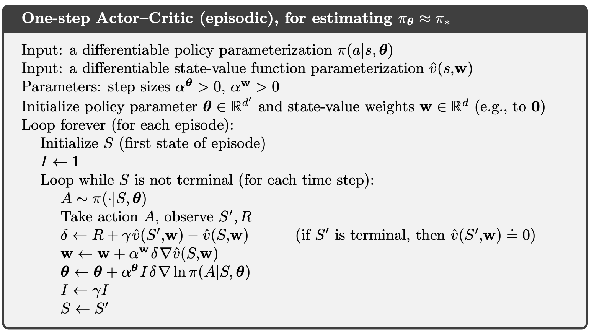

# 1. 背景

强化学习（Reinforcement Learning, RL）通过智能体与环境的交互，优化策略以最大化累积回报。在 A3C 提出之前（2016年），深度强化学习面临以下挑战：

- **高方差问题**：传统策略梯度方法（如 REINFORCE）因动作价值估计的方差高，导致训练不稳定。
- **样本效率低**：单线程交互（如 DQN）需要大量样本，训练速度慢。
- **样本相关性**：单线程生成的轨迹高度相关，限制了探索能力。
- **计算瓶颈**：深度神经网络的引入增加了计算需求，串行训练效率低下。

DeepMind 的 DQN（2015年）通过经验回放（Experience Replay）和目标网络（Target Network）提高了性能，但其串行训练和内存需求限制了扩展性。

## 1.1动机

A3C 的提出旨在解决上述问题，具体动机包括：

1. **提高样本效率**：通过异步并行训练多个智能体，加速学习过程。
2. **降低样本相关性**：多线程独立探索环境，增加样本多样性。
3. **提升稳定性**：结合 Actor-Critic 框架和优势函数，降低策略梯度方差。
4. **简化架构**：去除经验回放，降低内存需求，简化实现。
5. **实时性**：异步训练适合实时任务，如游戏和机器人控制。

A3C 由 Google DeepMind 团队于 2016 年提出，是一种高效、轻量级的深度强化学习算法。

## 1.2 A3C 要解决的问题及创新点

A3C 针对以下问题：

1. **低样本效率**：传统 RL 需要大量环境交互，训练时间长。
2. **样本相关性**：单线程交互的样本高度相关，影响策略优化。
3. **训练不稳定**：深度神经网络引入的高方差导致收敛困难。
4. **计算资源限制**：串行训练难以充分利用多核 CPU 或分布式系统。

A3C 的创新包括：

1. **异步并行训练**：多个线程并行与环境交互，异步更新全局网络参数，取代经验回放。
2. **优势函数**：降低策略梯度方差。
3. **Actor-Critic 框架**：结合策略（Actor）和价值估计（Critic），平衡探索与利用。
4. **熵正则化**：通过熵项促进策略的随机性，防止过早收敛。
5. **轻量化设计**：无需经验回放缓冲区，降低内存需求，适合资源受限环境。

相比 DQN，A3C 去除了经验回放，训练更快；相比传统 Actor-Critic，异步机制和优势函数提高了稳定性和效率。

------

# 2. A3C 的数学原理与推导过程

## 2.1强化学习基础

强化学习的目标是优化策略$ \pi(a|s;\theta) $，最大化期望累积回报$ J(\theta)=E_{\pi_\theta}[R] $。关键定义:

- 状态空间S，动作空间A。

- 策略$ \pi(a|s;\theta) $:在状态s下选择动作a的概率，参数为$ \theta $。

- 回报$ R_t $:$ R_t=\sum_{k=0}^{\infty}\gamma^k r_{t+k} $，其中$ r_t $是即时奖励，$ \gamma\in[0,1) $是折扣因子。

- 状态价值函数$ V(s) $:$ V(s)=E[R_t|s_t=s] $，状态s的期望回报。

- 动作价值函数$ Q(s,a) $:$ Q(s,a)=E[R_t|s_t=s,a_t=a] $，状态s下动作a的期望回报。

- 优势函数$ A(s,a) $:$ A(s,a)=Q(s,a)-V(s) $，衡量动作的相对优劣。

## 2.2策略梯度定理

策略梯度方法优化，梯度为:

$$ \nabla_\theta J(\theta)=E_{\pi_\theta}\left[\nabla_\theta \log \pi(a|s ; \theta) \cdot Q(s, a)\right] $$

变量:

$$ \nabla_\theta \log \pi(a|s ; \theta): \text{策略的对数似然梯度。} $$

$$ Q(s, a): \text{动作价值。} $$

由于Q(s,a)的估计方差高，A3C使用优势函数A(s,a)替代:

$$ \nabla_\theta J(\theta)=E_{\pi_\theta}\left[\nabla_\theta \log \pi(a|s ; \theta) \cdot A(s, a)\right] $$

## 2.2优势函数的估计

A3C使用n-步回报估计优势函数:

$$ A(s_t, a_t) \approx R_t^{(n)} - V(s_t, \theta_v) $$

其中:

$$ R_t^{(n)}=r_t+\gamma r_{t+1}+\cdots+\gamma^{n-1} r_{t+n-1}+\gamma^n V(s_{t+n}; \theta_v) : n \text{-步累积回报。} $$

$$ V(s_t, \theta_v): \text{Critic 网络对状态}s_t\text{的价值估计} \downarrow \text{参数为}\theta_v $$

推导:

1. 优势函数定义: $ A(s,a)=Q(s,a)-V(s) $。

2. $ Q(s,a) $ 通过 n-步回报近似:

$$ Q\left(s_{t}, a_{t}\right)\approx r_{t}+\gamma r_{t+1}+\cdots+\gamma^{n-1} r_{t+n-1}+\gamma^{n} V\left(s_{t+n} ;\theta_{v}\right) $$

3. 因此:

$$ A\left(s_{t}, a_{t}\right)=Q\left(s_{t}, a_{t}\right)-V\left(s_{t} ;\theta_{v}\right)\approx R_{t}^{(n)}-V\left(s_{t} ;\theta_{v}\right) $$

## 2.3价值函数优化

Critic 网络优化目标是最小化均方误差:

$$ L_v\left(\theta_v\right)=\mathbb{E}\left[\left(R_t^{(n)}-V\left(s_t ;\theta_v\right)\right)^2\right] $$

其中:

$$ \begin{array}{l}
R_t^{(n)}: n \text {-步回报,近似真实回报。 } \\
V\left(s_t ; \theta_v\right): \text { Critic 网络的价值估计。 }
\end{array} $$

## 2.4梯度推导

$$ \begin{array}{l}
\nabla_{\theta_{v}} L_{v}\left(\theta_{v}\right)=\nabla_{\theta_{v}}\left[\left(R_{t}^{(n)}-V\left(s_{t} ; \theta_{v}\right)\right)^{2}\right] \\
=-2\left(R_{t}^{(n)}-V\left(s_{t} ; \theta_{v}\right)\right) \cdot \nabla_{\theta_{v}} V\left(s_{t} ; \theta_{v}\right)
\end{array} $$

$$ \text { 解释: } \text { Critic 网络通过梯度下降调整 } \theta_{v} \text {, 使 } V\left(s_{t} ; \theta_{v}\right) \text {逼近 } R_{t}^{(n)} \text {. } $$

### 2.4.1澄清疑问(Critic损失与优势函数的区别)

优势函数 $ A\left(s_{t}, a_{t}\right)=R_{t}^{(n)}-V\left(s_{t} ; \theta_{v}\right) $ 是标量,用于 Actor 的策略梯度。

Critic损失 $ L_{v}\left(\theta_{v}\right)=\left(R_{t}^{(n)}-V\left(s_{t} ; \theta_{v}\right)\right)^{2} $ 是平方误差,用于优化 Critic参数。

两者都依赖 $ R_{t}^{(n)}-V\left(s_{t} ; \theta_{v}\right) $, 但用途不同:优势函数指导策略更新, Critic 损失优化价值估计。

## 2.5熵正则化

为促进探索，A3C在目标函数中加入熵项:

$$ J(\theta)=\mathbb{E}[\log \pi(a \mid s ; \theta) \cdot A(s, a)+\beta H(\pi(s ; \theta))] $$

变量:

$$ \begin{aligned}\boldsymbol{H}(\pi(s ; \theta)) & =-\sum_{a} \pi(a \mid s ; \theta) \log \pi(a \mid s ; \theta) : \text {策略熵。} \end{aligned} $$

$$ \beta : \text { 熵正则化系数。} $$

$$ \nabla_\theta H=\nabla_\theta\left[-\sum_{a} \pi(a \mid s ; \theta) \log \pi(a \mid s ; \theta)\right] $$

$$ =-\sum_{a} \nabla_\theta\left[\pi(a \mid s ; \theta) \log \pi(a \mid s ; \theta)\right] $$

- 应用乘积求导法则(对$ \pi \cdot \log \pi $求导):

$$ =-\sum_{a}\left[\nabla_\theta \pi(a \mid s ; \theta) \cdot \log \pi(a \mid s ; \theta)+\pi(a \mid s ; \theta) \cdot \nabla_\theta \log \pi(a \mid s ; \theta)\right] $$

- 化简第二项(利用对数导数性质):

$$ \nabla_\theta \log \pi=\frac{\nabla_\theta \pi}{\pi} \Longrightarrow \pi \cdot \nabla_\theta \log \pi=\nabla_\theta \pi $$

- 合并同类项得到最终结果:

$$ =-\sum_{a} \nabla_\theta \pi(a \mid s ; \theta) \cdot[\log \pi(a \mid s ; \theta)+1] $$

$$ =-\sum_{a} \nabla_{\theta} \pi(a \mid s ; \theta) \log \pi(a \mid s ; \theta) $$

- 总策略梯度为:

$$ \nabla_{\theta} J(\theta)=\mathbb{E}\left[\nabla_{\theta} \log \pi(a \mid s ; \theta) \cdot A(s, a)+\beta \nabla_{\theta} H(\pi(s ; \theta))\right] $$

解释:熵梯度鼓励策略分布更均匀，增强探索。

# 3.目标函数、梯度推导、网络更新

## 3.1 Actor 目标函数:

$$ J(\theta)=\mathbb{E}[\log \pi(a \mid s ; \theta) \cdot A(s, a)+\beta H(\pi(s ; \theta))] $$

- 变量:
  - $ \pi(a \mid s ; \theta) $: 策略概率
  - $ A(s, a) $: 优势函数
  - $ H(\pi(s ; \theta)) $: 策略熵
  - $ \beta $: 熵正则化系数

## 3.2 Critic 目标函数:

$$ L_v\left(\theta_v\right)=\mathbb{E}\left[\left(R_t^{(n)}-V\left(s_t ; \theta_v\right)\right)^2\right] $$

### 3.1.1网络结构

- **Actor 网络**: 输出策略 $ \pi(a \mid s ; \theta) $，如 softmax 概率
- **Critic 网络**: 输出价值 $ V(s ; \theta_v) $，标量
- **共享层**: Actor 和 Critic 可共享特征提取层（如 CNN）

## 3.3梯度推导

### 3.3.1 Actor 梯度:

$$ \nabla_\theta J(\theta)=\nabla_\theta \log \pi(a \mid s ; \theta) \cdot A(s, a)+\beta \nabla_\theta H(\pi(s ; \theta)) $$

- 更新规则:

$$ \theta \leftarrow \theta + \alpha \cdot \nabla_{\theta} J(\theta) $$

- $ \alpha $：Actor 学习率。

### 3.3.2 Critic 梯度:

$$ \nabla_{\theta_v} L_v\left(\theta_v\right)=-2\left(R_t^{(n)}-V\left(s_t ; \theta_v\right)\right) \cdot \nabla_{\theta_v} V\left(s_t ; \theta_v\right) $$

- 更新规则:

$$ \theta_v \leftarrow \theta_v - \beta \cdot \nabla_{\theta_v} L_v(\theta_v) $$

- $ \beta $：Critic 学习率。

# 4.其他补充

## 4.1带资格迹

Continuing问题指没有终止状态的持续型任务，其关键特性包括：

1. 无限时间 horizon ($t \to \infty$)
2. 需使用平均奖励准则
3. 传统折扣因子$$ \gamma = 1 $$（无自然衰减）

$$ \delta = R - \bar{R} + V(S') - V(S) $$

| 公式组件       | Episodic AC                       | Continuing AC (图示算法)                                 |
| -------------- | --------------------------------- | -------------------------------------------------------- |
| 回报定义       | $$ \sum_{t=0}^{T} \gamma^t R_t $$ | $$ \lim_{T \to \infty} \frac{1}{T} \sum_{t=0}^{T} R_t $$ |
| TD误差         | $$ R + \gamma V(S') - V(S) $$     | $$ (R - \bar{R}) + V(S') - V(S) $$                       |
| 值函数更新目标 | 折扣累积积分值                    | 相对平均奖励的偏差值                                     |

**参数说明**

- **输入：**
  - 可微策略函数：$$ \pi(a|s, \theta) $$，输出动作概率。
  - 可微状态值函数：$$ \hat{v}(s, w) $$，近似真实值$$ v_\pi(s) $$。

- **参数：**
  - 资格迹衰减率：$$ \lambda^w, \lambda^\theta \in [0, 1] $$。
  - 学习率：$$ \alpha^w, \alpha^\theta, \alpha \bar{R} > 0 $$。

- **初始化：**
  - 平均奖励$$ \bar{R} = 0 $$（用于中心化TD误差）。
  - 权重$$ w $$和策略参数$$ \theta $$初始化为0或随机值。
  - 初始状态$$ S = s_0 $$。
  - 资格迹向量$$ z^w = 0, z^\theta = 0 $$。

--------

### 4.1.1 对比TD资格迹

 **TD(λ) 中的资格迹机制**

- 状态访问时：对当前状态的资格迹进行+1的增量（称为"替换迹" replace trace）
  $$ e(s) \leftarrow e(s) + 1 $$

- 状态未访问时：对所有状态的资格迹进行衰减（乘以λγ，其中γ是折扣因子）
  $$ z^w \leftarrow \lambda z^w + \nabla \hat{v}(S,w) $$

  $$ z^\theta \leftarrow \lambda z^\theta + \nabla \ln \pi(A|S,\theta) $$

1. TD(λ)采用"状态访问计数+衰减"机制（适合值函数更新）
2. Actor-Critic 采用"梯度累积+衰减"机制（适合参数优化）