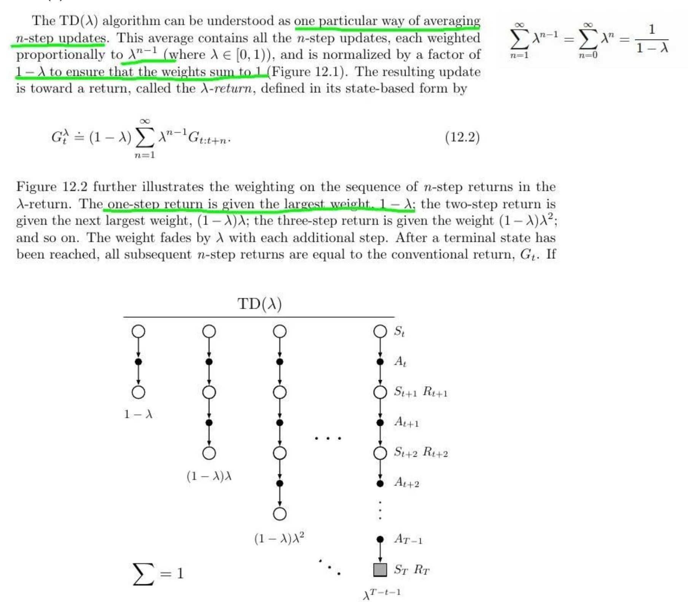

在强化学习中，**值估计（Value Estimation）**是指对某个状态或状态-动作对的“好坏”进行评估，其核心目标是学习以下两个函数之一：

- **状态值函数 $V^π(s)$**：表示在策略 $π$ 下，从状态 $s$开始的期望累积回报。

- **状态-动作值函数 $Q^π(s,a)$**：表示在策略 $π$ 下，从状态$s$开始执行动作 $a$，然后遵循 $π$ 所获得的期望回报。

  

## 值估计的三种主要方法

  | 方法名称              | 是否使用模型 | 是否使用目标值函数  | 是否偏差（Bias） | 是否高方差（Variance） |
  | --------------------- | ------------ | ------------------- | ---------------- | ---------------------- |
  | 1. 蒙特卡洛方法（MC） | 否           | 否                  | 无偏（Unbiased） | 高方差                 |
  | 2. 时序差分学习（TD） | 否           | 是（bootstrapping） | 有偏             | 方差较小               |
  | 3. 动态规划（DP）     | 是           | 是                  | 理论准确         | 依赖完整模型           |

# 1. 蒙特卡洛方法（Monte Carlo, MC）

只在一次完整的轨迹（episode）结束后，通过**实际获得的总回报**来更新值函数。

## 状态值估计公式：

$$
V(s) = \frac{1}{N(s)} \sum_{i=1}^{N(s)} G_t^{(i)}
$$

- $$
  G_t = \sum_{k=0}^{T - t - 1} \gamma^k r_{t+k+1} \quad \text{：从时间 } t \text{ 开始的累计回报}
  $$

- $$
  N(s) \text{：状态 } s \text{ 出现的次数}
  $$

## 1.1 首次访问MC（First-Visit MC）

对每条轨迹中状态$s$ 的第一次出现计算回报 $G_t$，然后取所有轨迹的平均。

## 1.2 每次访问MC（Every-Visit MC）

对**所有状态 $s$ 的出现**计算回报 * $G_t$*，然后取平均。

## 1.3 MC 增量式更新（Incremental MC）

在强化学习中，蒙特卡洛（MC）方法的值函数更新可以分为**增量式更新**和**非增量式更新（批量更新）**两种方式。它们的核心区别在于**如何利用新数据修正现有估计**

--------

为避免存储所有  $G_t$，可采用**增量式更新**（类似随机梯度下降）：

$V(S_t)←V(S_t)+α(G_t−V(S_t))$

其中 $α$ 是学习率。

**推导过程**：

1. 设已有 *n* 个样本，均值 $V_n=\frac{1}{n}∑G_i$

2. 新样本 *G**n*+1 到来时：$V_{n+1}=V_n+\frac{1}{n+1}(G_{n+1}−V_n)$

3. 令 $α=\frac{1}{n+1}$，即得增量更新公式。

----------
**优点**

**低内存开销**：无需存储历史数据。
**在线学习**：每收到一个样本立即更新，适合流式数据。
**计算高效**：每次更新仅需一次加减乘除运算。
**学习率选择敏感**：

- 递减学习率保证收敛，但可能“遗忘”早期样本。
- 固定学习率适应非平稳环境，但可能无法收敛。

| 特性       | 非增量式更新                 | 增量式更新                      |
| ---------- | ---------------------------- | ------------------------------- |
| 存储需求   | 需保存所有历史回报 $\{G_i\}$ | 仅需维护 $V(s)$ 和计数 $n(s)$   |
| 计算复杂度 | 高（每次更新需全量计算均值） | 低（单次运算）                  |
| 适用场景   | 离线学习，小规模数据         | 在线学习，大规模或连续数据      |
| 偏差-方差  | 无偏                         | 固定学习率可能有偏              |
| 收敛性     | 必然收敛（大数定律）         | 依赖学习率选择（需满足SGD条件） |

---

### 1.4 无偏估计

蒙特卡洛方法通过对某个状态或状态-动作对多次采样轨迹，计算这些轨迹的**平均回报**来逼近期望值，即：

$$
V(s) \approx \mathbb{E}_\pi[G_t \mid S_t = s] = \frac{1}{N(s)} \sum_{i=1}^{N(s)} G_t^{(i)}
$$

这个过程确实就是根据**样本均值逼近期望值**，与经典的统计估计类似。

- **大数定律保证**：当 $N \to \infty$，样本均值收敛于真实期望。
- 因此，蒙特卡洛估计在理论上是**无偏的**（unbiased），因为它没有引入模型的假设，也没有自举（bootstrapping）行为。

## 1.5 方差大

虽然它是无偏估计，但**方差可能非常大**，原因如下：

**原因1：回报是整条轨迹累计的**

蒙特卡洛估计中，回报 $$G_t = r_{t+1} + \gamma r_{t+2} + \gamma^2 r_{t+3} + \cdots$$ 是一条完整轨迹的总和，这就意味着：

- 任意一步的小的随机波动，都会通过累积在 $$G_t$$ 中体现出来。
- 特别是在长期任务（比如 γ 接近 1）中，轨迹长度很长时，单次估计的波动非常大。

**原因2：策略初期不稳定 → 数据质量差**

在学习早期，策略可能是随机的，产生很多**无效轨迹**（例如从状态s出发最终没学到奖励），导致估计回报本身波动很大。

**例子：**

假设一个状态 sss 只出现了3次，得到的回报分别是：

- 第一次：+100（幸运地得到了终点）
- 第二次：0（中途死亡）
- 第三次：+50（半路到达）

但我们看得出，这个50的估计是**高度不稳定的**，下一次采样可能又是0或100，方差很大。

# 2. 时序差分学习
**时序差分学习（Temporal Difference Learning, TD Learning）是一种用于强化学习中的预测问题**和**策略评估**的方法，它结合了**动态规划**和**蒙特卡洛方法**的优点，在智能体与环境的交互过程中，不必等到一个完整的回合结束就可以更新价值估计。

## 2.1 核心思想

时序差分学习的核心是使用当前状态的**估值**与**下一个状态的估值之间的差值**来调整当前的价值估计。

这个差值被称为TD误差（**Temporal Difference Error**）。

✅ **TD(0)算法（最基本的时序差分算法）**

对于每一步的更新：

$$
V(s_t) \leftarrow V(s_t) + \alpha \left[ r_{t+1} + \gamma V(s_{t+1}) - V(s_t) \right]
$$

其中：

- $\alpha$：学习率  
- $r_{t+1}$：从 $s_t$ 转移到 $s_{t+1}$ 所获得的奖励  
- $\gamma$：折扣因子  
- $V(s_t)$：当前状态的估值  
- $$\text{TD误差}：\quad \delta_t =r_{t+1} + \gamma V(s_{t+1}) - V(s_t)$$

---

## 2.2 Bootstrap理解

- **英文原意**：指靴子后方的皮革环（boot strap），用于帮助穿鞋时用手提起靴子。
- **中文直译**：“靴襻”（较少用），或形象化为“**拉鞋带**”。
- **经典比喻**：  
  “拽着鞋带把自己拎起来” → 形容 **“不可能的自助行为”**，后引申为 **“依靠自身资源启动”**。

---

- **自我迭代更新**：用当前的价值估计 $V(s_{t+1})$ 来更新自身 $V(s_t)$，类似“拽着自己的鞋带把自己提起来”的比喻。
- **基于估计的估计**：不同于蒙特卡洛依赖实际回报的完整采样，TD用后续状态的现有估计（$\gamma V(s_{t+1})$）替代部分真实回报。

$$
V(s_t) \leftarrow V(s_t) + \alpha \left[ r_{t+1} + \gamma V(s_{t+1}) - V(s_t) \right]
$$

## 2.3 TD(λ) ：

- **Monte Carlo（MC）方法**：要等到一次完整的 episode 执行完后才能更新，样本利用效率低，方差高。
- **TD(0) 方法**：使用一步 bootstrapping 更新当前状态的值，收敛快但偏差较大。

- **TD(λ) ** 想要 **在 MC（高方差低偏差）和 TD(0)（低方差高偏差）之间找到折中点**，提高学习效率与稳定性。

------

### 2.3.1 引入 Eligibility Trace

**1. 资格迹的核心定义**

资格迹是TD(λ)算法的核心机制，用于**将当前奖励分配到过去一系列状态**，结合即时奖励与历史状态信息改进学习过程。**类似** “短期记忆”，记录状态-动作对在过去时间步的出现情况。

 **2. 资格迹的作用**

- **加速奖励传播**：通过更新当前状态的同时，也更新过去相关状态的值，避免奖励信息传递延迟。
- **时间衰减特性**：距离当前时间步越远的状态，其资格迹权重越小（如λ控制衰减速率）。

**3. TD(λ)更新机制**

- 每次访问状态时，其资格迹值会提升（如+1）。
- 更新时不仅调整当前状态值，还会按资格迹权重调整历史状态值。

- **衰减公式**：资格迹随时间按λ系数衰减（λ∈[0,1]），体现“近因优先”原则。

**4. 衰减控制**：通过λ调节对过去状态的更新强度（λ=1→MC，λ=0→TD(0)）。

------

**资格迹** $e_t(s)$ 表示某状态 $s$ 在当前时间步 $t$ 对参数更新的“责任程度”，是一个衰减的记忆。

公式：

$e_t(s)=γλe_{t−1}(s)+1(s_t==s)$

- $λ∈[0,1]$：控制资格迹的衰减速度。
- $1(st=s)$：表示当前访问的是否是该状态，是则加一。

### 2.3.2 TD(λ) 更新公式

先定义 **TD误差**（temporal-difference error）：

$$ \delta_{t}=r_{t}+\gamma V(s_{t+1})-V(s_{t}) $$

然后对每一个状态s进行更新：$$ V(s)\leftarrow V(s)+\alpha\delta_{t} e_{t}(s) $$

### 例子：

假设：

- γ=0.9，λ=0.8
- 状态空间：A, B, C
- 初始时刻 $e_0(A)=e_0(B)=e_0(C)=0$

执行轨迹如下（每一行为一个时间步）：

| 时间 t | 当前状态 $s_t$ | $e_t(A)$               | $e_t(B)$                        | $e_t(C)$ |
| -------- | ---------------- | ----------------------------------------------------------- | -------------------------------------------- | ---------------- |
| 1        | A                | 1                                                           | 0                                            | 0                |
| 2        | B                | 0.9×0.8×1=0.72                | 1                                            | 0                |
| 3        | C                | 0.9×0.8×0.72=0.51840.9×0.8×0.72 =0.5184 | 0.9×0.8×1=0.720.9×0.8×1=0.72 | 1                |

每次访问新的状态，会使该状态的资格迹加 1，其余状态以 γλ 衰减。

 **“意味着：当前的 TD 误差被回传给所有之前访问过的状态，但通过资格迹加权。”**

这是描述 TD(λ) 的 **权责分配机制**：不仅更新当前状态的值，还让**所有曾经出现过的状态都“分担”当前的误差，但权重根据资格迹（即距离）来调整。**

我们在时间步 t=3 处经历了状态序列 A → B → C，设当前 TD 误差 $δ_3=1.2$，学习率 $α=0.1$。

那么每个状态的值函数会更新为：

$$
V(A) \leftarrow V(A) + 0.1 \cdot 1.2 \cdot 0.5184 = V(A) + 0.0622
$$

$$
V(B) \leftarrow V(B) + 0.1 \cdot 1.2 \cdot 0.72 = V(B) + 0.0864
$$

$$
V(C) \leftarrow V(C) + 0.1 \cdot 1.2 \cdot 1 = V(C) + 0.12
$$

这就是**误差的责任分配**：最近的状态（C）更新最多，越久以前的状态（A）更新越少。

### 2.3.3 重要 - 推导MC、TD(0)

#### 2.3.3.1 公式推导

- 无限求和公式（原定义）：

  $$
  G_t^{(\lambda)} = (1-\lambda) \sum_{n=1}^{\infty} \lambda^{n-1} G_t^{(n)}
  $$

  适用于无期限步长的情况（如非终止任务）。

- 有限求和公式：

  $$
  G_t^{(\lambda)} = (1-\lambda) \sum_{n=1}^{T - t} \lambda^{n-1} G_t^{(n)} + \lambda^{T - t} G_t^{(T - t)}
  $$

  适用于有限步长（episodic任务），其中 $T$ 是终止时刻。

**关键点**：

- 在 episodic 任务中，当 $n \geq T - t$ 时，$G_t^{(n)} = G_t^{(T - t)}$（因为到达终止状态，后续回报不变）。

- 因此，无限求和公式可以拆分为两部分：
  - 前 $T - t$ 项：
    $$
    (1-\lambda) \sum_{n=1}^{T - t} \lambda^{n-1} G_t^{(n)}
    $$
  - 剩余无限项：
    $$
    (1-\lambda) \sum_{n=T - t+1}^{\infty} \lambda^{n-1} G_t^{(T - t)} 
    = \lambda^{T - t} G_t^{(T - t)}
    $$
    （通过等比数列求和公式 $\sum_{k=0}^{\infty} \lambda^k = \frac{1}{1-\lambda}$ 可验证）

---

#### 2.3.3.2 为什么最后一项单独列出？

- 在 episodic 任务中，终止状态后的所有 $G_t^{(n)}$ 都等于 $G_t^{(T - t)}$（即完整 Monte Carlo 回报）。

- 因此，无限求和的后半部分可以合并为一项：
  $$
  (1-\lambda) \lambda^{T - t} G_t^{(T - t)} \cdot (1 + \lambda + \lambda^2 + \cdots ) 
  = \lambda^{T - t} G_t^{(T - t)}
  $$

---

#### 2.3.3.3 λ=1特殊情况

- 因为特殊情况“当 $\lambda=1$ 时”的推导：
  - 前 $T - t$ 项的系数 $(1-\lambda) \lambda^{n-1}$ 全部为 0。
  - 最后一项 $\lambda^{T - t} G_t^{(T - t)} = G_t^{(T - t)}$（即 Monte Carlo 回报），此时 TD($\lambda$) 完全退化为 MC 方法。

- **不是仅更新当前状态（像 TD(0)）**；
- **也不是等待整个 episode 结束才更新（像 Monte Carlo）**；
- 而是：**把误差及时地传递给所有“仍在资格内”的状态，使学习更加高效和稳定**。

------
## references
https://goodboychan.github.io/reinforcement_learning/2020/06/17/04-Temporal-Difference-Learning-TD-lambda.html
https://amreis.github.io/ml/reinf-learn/2017/11/02/reinforcement-learning-eligibility-traces.html

https://blog.csdn.net/weixin_49379140/article/details/132035329?spm=1001.2014.3001.5502

## 2.3 优点

**没有等完整的 episode 结束**（不像蒙特卡洛方法那样）

TD目标仅依赖单步奖励和现有价值函数，方差显著降低，但引入了 $V(s_{t+1})$ 的估计偏差。

-------

# 3.重要性采样

## 3.1定义

重要性采样基于以下式子成立：

$$
E_{x \sim p} [f(x)] = E_{x \sim q} \left[ f(x) \cdot \frac{p(x)}{q(x)} \right]
$$

- $p(x)$: 目标分布（我们想计算的分布）。
- $q(x)$: 采样分布（实际上能采样的分布）。
- $\frac{p(x)}{q(x)}$: 重要性权重，用于修正采样偏差。

推导过程

1. 根据期望定义：
$$
E_{x \sim p} [f(x)] = \int f(x) p(x) dx
$$

2. 乘以和除以 $q(x)$（恒等变形）：
$$
\int f(x) p(x) dx = \int f(x) \frac{p(x)}{q(x)} q(x) dx = E_{x \sim q} \left[ f(x) \cdot \frac{p(x)}{q(x)} \right]
$$

3. 结论：通过权重 $\frac{p(x)}{q(x)}$，将 $q$ 的期望转换为 $p$ 的期望。

---------
## 3.2 举例

- **场景**：你想计算全班平均身高，但只能采访“戴眼镜的同学”（采样分布 *q*），而真实分布 *p* 是全班所有人。

- **问题**：戴眼镜的同学可能身高分布有偏差（例如近视率高的人群平均身高不同）。

- **解决**:对每个戴眼镜的同学，根据其代表的全班比例赋予权重。
  - 如果戴眼镜同学占全班的30%，则其权重为 0.31≈3.33。
  
  - 加权后的平均身高可逼近真实全班平均。
  
--------

## 3.3 在强化学习中的对应

- **行为策略 π**：实际采样轨迹的策略（如随机策略）。

- **目标策略 π′**：待评估的策略（如最优策略）。

- **重要性权重**：$ρ=\frac{π(a∣s)}{π′(a∣s)}$，修正动作概率的差异。

### 3.3.1 策略评估 (Off-Policy Evaluation)

- 目标：用行为策略 $\pi$ 的样本来估计目标策略 $\pi^*$ 的值函数 $V^{\pi^*}$。

- 轨迹权重：一条轨迹在 $\pi$ 和 $\pi^*$ 下的概率比为：
$$
\rho(\tau) = \prod_{t=0}^{T} \frac{\pi'(a_t | s_t)}{\pi(a_t | s_t)}
$$

### 3.3.2 普通重要性采样 (Ordinary IS)

其中 $\rho(\tau_i)$ 是轨迹 $\tau_i$ 的重要性权重。

$$
V^\pi \approx \frac{1}{N} \sum_{i=1}^N \rho(\tau_i) G(\tau_i)
$$

### 3.3.3 加权重要性采样 (Weighted IS)

$$
V^\pi \approx \frac{\sum_{i=1}^N \rho(\tau_i) G(\tau_i)}{\sum_{i=1}^N \rho(\tau_i)}
$$

#### 3.3.3.1 为什么需要加权？

- 普通IS的问题：
  - 若行为策略 $\pi$ 和目标策略 $\pi^*$ 差异较大，权重 $\rho(\tau_i)$ 可能非常大，以致计算的方差极高（例如某些轨迹的权重是1000倍，另一些是0.001倍）。
  
  例如：10条轨迹中，1条权重为10，其他为0.1，普通IS会过度依赖高权重轨迹。

- 加权IS的改进：
  - 通过归一化权重（即限制总权重 $\sum \rho(\tau_i)$，限制单个样本的极端影响），降低方差（但引入轻微偏差）。

| 性质     | 普通IS             | 加权IS             |
| -------- | ------------------ | ------------------ |
| 无偏性   | 无偏               | 有偏（但精进无偏） |
| 方差     | 高（权重非常极端） | 低（权重归一化）   |
| 适用场景 | 理论分析           | 实际应用           |

### 3.3.4值函数估计

$Vπ′(s)=E_{τ∼π}[ρ(τ)G(τ)]$其中 $G(τ)$ 是轨迹 τ 的回报。

--------

## 3.4 前提条件

重要性采样做的是“概率修正”

**重要性采样（Importance Sampling, IS）** 是一种用于从一个策略（行为策略，behavior policy）估计另一个策略（目标策略，target policy）期望的方法，常用于 **离策略学习（off-policy learning）** 场景。

### 3.4.1 例子：估计目标策略的状态值函数

假设一个简单环境：

- 状态空间 $S = s_0, s_1$
- 动作空间 $A = a_0, a_1$
- 行为策略 $b(a_0 | s_0) = 0.8, b(a_1 | s_0) = 0.2$
- 目标策略 $\pi(a_0 | s_0) = 0.5, \pi(a_1 | s_0) = 0.5$

我们从 $bbb$ 中采样轨迹，得到：

1. $s_0 \xrightarrow{a_0} r = 1, s_1$

$$
G = 1, w = \frac{\pi(a_0 | s_0)}{b(a_0 | s_0)} = \frac{0.5}{0.8} = 0.625
$$

2. $s_0 \xrightarrow{a_1} r = 2, s_1$

$$
G = 2, w = \frac{0.5}{0.2} = 2.5
$$

加权重要性采样估计：

$$
V^\pi(s_0) = \frac{0.625 \cdot 1 + 2.5 \cdot 2}{0.625 + 2.5} = \frac{0.625 + 5}{3.125} = \frac{5.625}{3.125} \approx 1.8
$$

------

### 3.4.2 已知目标 π 的分布，但无法和环境交互
- **尚未部署的新策略**
- **正在优化的目标策略**
虽然π 是新策略，但是环境只能通过行为策略 b 产生数据（例如历史日志、真实系统中部署的是 b）
 **所以我们从 b 得到数据，再用 IS 修正分布**

- 那如果我们真的能用 π 和环境交互呢？这就是 **on-policy** 的估计，不需要重要性采样。

## 3.5 重要性采样的离线策略时序差分方法

$V(sₜ) ← V(sₜ) + α[\frac{(π(aₜ|sₜ)}{μ(aₜ|sₜ)}(rₜ + γV(sₜ₊₁)) - V(sₜ)]$

- π/μ是重要性采样比，用于修正策略差异
- 括号内整体构成时序差分误差
- α是学习率

**优势**

- 方差显著低于蒙特卡洛重要性采样（因为只做单步修正）
- 对策略近似的要求更低（只需单步行为策略μ与目标策略π近似）

该方法的本质是通过重要性采样比来"纠正"行为策略与目标策略之间的差异，使得用μ收集的数据能用于π的价值函数估计。其单步修正特性使其在方差控制方面优于需要整条轨迹修正的MC方法，是离线策略学习中的经典技术。
