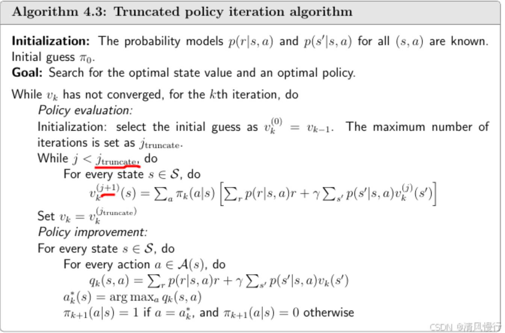

# 一、策略迭代

## 1 算法过程

1. **初始化策略**：
   随机选择初始策略 $π_0$

   $π_0(a∣s)←任意分布（如均匀分布）$

   

2. **策略评估（Policy Evaluation）**：
   计算当前策略 $π_k$ 的值函数 $V^{πk}(s)$，通过迭代解贝尔曼方程直至收敛：

    $V^{πk}(s)=R(s,π_k(s))+γ∑P(s′∣s,π_k(s))V^{πk}(s′)$

   - **终止条件**：$∥*V_{k+1}−V_k∥<θ$。

     

3. **策略改进（Policy Improvement）**：
   对每个状态 *s*，选择最大化动作来更新策略：

   $π_{k+1}(s)=arg^amax[R(s,a)+γs′∑P(s′∣s,a)Vπ_{k}(s′)]$

   - **终止条件**：若 $π_{k+1}=π_k$，算法终止。

     

4. **重复**：
   循环执行步骤2和3，直到策略不再变化


**其他版本**





------

## 2 例子：简单网格世界（Gridworld）

假设一个 3x3 的网格世界如下：

```
+---+---+---+
| S |   | G |
+---+---+---+
|   |   |   |
+---+---+---+
|   |   |   |
+---+---+---+
```

- S 是起始点，G 是目标状态（终止状态）
- 每个动作（上/下/左/右）成功概率为1
- 每步奖励为 -1，目标状态 G 的奖励为 0，且进入 G 后结束
- 折扣因子 γ = 1

### 初始策略 π₀

比如 π₀ 是一个“随机策略”，即每个状态下随机选择动作（每个动作概率为 0.25）

### 步骤 1：策略评估

使用迭代法或直接解线性方程组，计算每个状态的值  $V^{π0}(s)$

### 步骤 2：策略改进

对于每个非终止状态 s，选择一个使得：
$$ a^{*} = \arg\max _{a}\sum_{s^{\prime}} P\left(s^{\prime}\mid s,a\right)\cdot\left[R\left(s, a,s^{\prime}\right)+\gamma V^{\pi_{0}}\left(s^{\prime}\right)\right] $$

从而得到一个新的策略 π₁。

### 重复以上过程，直到策略收敛。


# 二、值迭代

值迭代是另一种求解马尔可夫决策过程（MDP）的经典算法，与策略迭代不同的是：

- **值迭代**不先求策略，而是通过不断更新值函数 $V(s)$，一步一步“逼近”最优值函数；
- 同时隐式地进行策略改进（通过最大化动作价值）。

------

## 1. 算法过程

1. **初始化值函数**：
   设初始值函数 $V_0(s)=0$（或随机值）。


2. **值函数更新（Value Update）**：
   对每个状态 s，直接应用贝尔曼最优方程迭代更新：

$V_{k+1}(s)=max^a[R(s,a)+γ∑P(s′∣s,a)V_{k}(s′)]$

- **终止条件**：$∥*V_{k+1}−V_k∥<θ$。


3. **策略提取（Policy Extraction）**：
   在值函数收敛后，一次性提取最优策略 *π*∗：

$π^∗(s)=arg^amax[R(s,a)+γs′∑P(s′∣s,a)Vπ_{k}(s′)]$


------

## 2. 例子：简单网格世界（Gridworld）

```
+----+----+----+
| S  |    | G  |
+----+----+----+
|    |    |    |
+----+----+----+
|    |    |    |
+----+----+----+
```

- S 是起点，G 是目标（终止）状态
- 每一步代价为 -1（奖励）
- G 的奖励为 0，且进入后不再移动
- 折扣因子 γ = 1
- 动作是确定性的（上、下、左、右）

### 初始化
设所有状态 $$ V(s) = 0 $$

### 迭代更新值函数
对每个非终止状态，计算：$$ V(s) = \max_{a \in A}\left[-1 + \gamma V(s')\right] $$
这里 $$ s' $$ 是执行动作 $$ a $$ 后到达的下一个状态。

### 示例：
假设从状态 A 可以：
- 往右到 B（当前 $$ V(B) = 2 $$）
- 往下到 C（当前 $$ V(C) = 1 $$）
- 其他方向越界或到达值低的状态  
则：$$ V(A) = \max(-1 + V(B), -1 + V(C),...) = \max(1, 0,...) = 1 $$  
每次迭代都对所有状态执行一次更新，直到值函数收敛。

## 三、对比
|                    | 策略迭代                                                     | 值迭代                                                     |
| ------------------ | ------------------------------------------------------------ | ---------------------------------------------------------- |
| V的更新目标        | 是当前策略 $$ \pi $$ 的值函数 $$ V^{\pi} $$，不带 $$ \max $$ | 直接逼近最优值函数 $$ V^{*} $$，每次都带 $$ \max $$        |
| 策略更新时机       | 评估完一整轮策略后，再用 $$ \max $$ 更新策略                 | 每次更新 $$ V $$ 时就隐式用了 $$ \max $$（同时做策略改进） |
| 计算策略 $$ \pi $$ | 显式维护策略 $$ \pi(s) $$，单独的结构                        | 不维护 $$ \pi(s) $$，最后才通过最大化从 $$ V $$ 中提取     |
