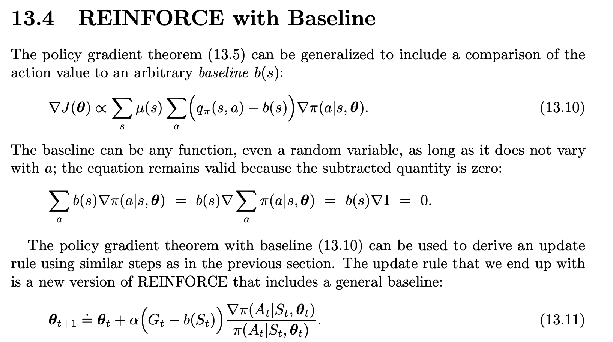
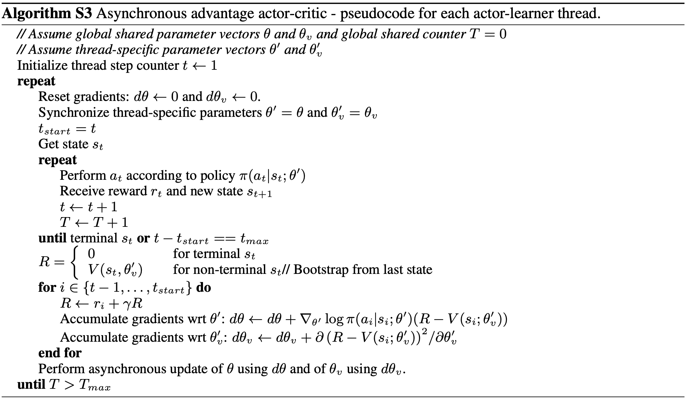

# 1. policy gradient

**论文**

Policy Gradient Methods for Reinforcement Learning with Function Approximation 

 https://proceedings.neurips.cc/paper_files/paper/1999/file/464d828b85b0bed98e80ade0a5c43b0f-Paper.pdf

## 1.1 动机

强化学习（Reinforcement Learning, RL）是一种机器学习方法，它通过智能体与环境的交互来学习最优策略（policy）。强化学习的核心是通过奖励信号来训练智能体，使其在不同的环境状态下采取最优的行动。然而，传统的强化学习算法（如Q-learning）主要适用于离散动作空间，且面临着高维状态和动作空间时，效率和精度可能降低。

**策略梯度（Policy Gradient）算法**是强化学习中的一种方法，旨在解决高维动作空间和连续动作问题，特别适用于那些离散空间方法不适用的问题。通过直接优化智能体的策略函数，而不是值函数，策略梯度方法能够在连续空间和高维度的状态/动作空间中取得较好的效果。

**问题：**

传统强化学习（如Q-learning、SARSA）在解决连续动作空间或高维状态空间问题时面临挑战：

- 值函数方法需维护庞大的Q-table或函数逼近器，离散化操作常常导致过于粗糙的结果。
- 最优策略可能不是确定性的（如π(s)→a），而是需要随机策略（如π(a|s)）

**动机**：
直接参数化策略函数πθ(a|s)，通过梯度上升优化策略性能：

- 避免值函数估计误差传播
- 天然支持随机策略
- 适用于连续动作空间（如机器人控制）

**创新点**：

- **直接策略优化**：直接优化智能体的策略函数，而不是间接通过价值函数进行优化。
- **策略参数化**：能够在高维和连续的动作空间中有效工作，不需要进行动作空间的离散化。
- **梯度理论**：通过梯度下降方法，策略可以逐步调整，使得每次采样都能朝着更好的策略方向发展。

## 1.2 算法过程

策略梯度的核心思想是通过优化策略函数 ）来最大化期望累积奖励。

目标是最大化智能体的长期奖励。

### 1.2.1公式推导

**目标函数**

期望回报 $J(\theta) = E_{\tau \sim \pi_\theta}[R(\tau)]$，其中 $R(\tau) = \sum_{t=0}^{T} \gamma^t r_t$

梯度推导：

1. 展开期望表达式：
$$
\nabla_\theta J(\theta) = \nabla_\theta \int \pi_\theta(\tau) R(\tau) d\tau
$$

2. 使用对数导数技巧 $\nabla_\theta \pi_\theta = \pi_\theta \nabla_\theta \log \pi_\theta$：
$$
\nabla_\theta J(\theta) = \int \pi_\theta(\tau) \nabla_\theta \log \pi_\theta (\tau) R(\tau) d\tau
$$

3. 分解轨迹概率 $\pi_\theta(\tau) = p(s_0) \prod_{t=0}^{T-1} \pi_\theta(a_t|s_t) p(s_{t+1}|s_t, a_t)$：
$$
\nabla_\theta \log \pi_\theta(\tau) = \sum_{t=0}^{T} \nabla_\theta \log \pi_\theta(a_t|s_t)
$$

4. 最终梯度公式（REINFORCE）：

$$
\nabla_\theta J(\theta) = E_{\tau \sim \pi_\theta} \left[ \left( \sum_{t=0}^{T} \nabla_\theta \log \pi_\theta(a_t|s_t) \right) \left( \sum_{t'=0}^{T} \gamma^{t'} r_{t'} \right) \right]
$$

### 1.2.2 迭代过程

#### 1.2.2.1 Reinforce

#### 1.2.2.1 Reinforce with baseline

##### 1.2.2.1.1 为什么加baseline

**R(τ) 是轨迹 τ 的总回报。如果不使用 baseline，梯度估计完全依赖于 R(τ)，而 R(τ) 的方差可能非常大。**

假设在 CartPole 环境中，初始策略随机向左或向右移动。某次采样中，由于随机性，策略偶然保持平衡很长时间，获得了很高的回报 R(τ)=1000，而大多数轨迹的回报只有 R(τ)=10。此时，梯度更新会过度偏向于这个高回报轨迹的动作，即使这些动作可能只是偶然成功。这会导致策略更新方向不稳定，甚至可能“错误”地强化一些不好的动作。

如果 R(τ) 特别大（比如偶然成功），策略会过度更新 $π_θ(a∣s)$，可能导致 $π_θ(a∣s)$ 接近 1，从而抑制对其他动作的探索。这种过度优化会导致策略崩溃（只选择某个动作）或震荡（因为后续采样可能无法复现高回报）。

**例子**：在 Atari 游戏中，假设初始策略随机选择动作。某次采样中，策略偶然在某个状态 s选择了动作 a（比如“开火”），并恰好击中了敌人，获得了高回报。由于没有 baseline，策略会大幅增加 $π_θ(a∣s)$ 的概率。然而，这个动作可能只是在特定情况下有用（比如敌人恰好处于某个位置），过度优化会导致策略在其他场景中盲目选择“开火”，反而降低整体性能。

##### 1.2.2.1.2 baseline解决的问题

**1. 方差降低**：

- 原始梯度中，G可能很大（尤其是回合累计奖励高的场景），导致梯度幅度波动剧烈。

- 减去基线后，优势函数 A=Q−V 表示的是动作的**相对优势**，其数值范围显著缩小（例如从 [0,1000] 变为 [−50,50]），从而降低方差。

- **高方差带来的训练不稳定**

  - 现象：梯度估计的剧烈波动会导致策略参数更新幅度差异极大，可能出现：
    - 策略突然崩溃（参数更新到无效区域）
    - 收敛速度极慢（需要大量样本平均噪声）

  - **实验对比**：在CartPole任务中，无基线的REINFORCE算法需要10倍以上的训练回合才能达到相同效果。

**2.少采样的动作训练失效**
- **问题本质**：策略梯度依赖于蒙特卡洛采样，若动作 a 被采样的概率 π(a∣s) 很低，其梯度项 $∇_θlogπ_θ(a∣s)Q(s,a)$ 的贡献会被高概率动作主导。
- **具体表现**：
对于稀疏奖励任务，若某个高回报动作初始概率低，可能因采样不足而永远无法被优化。
即使偶然采样到高回报动作，由于 Q(s,a) 的绝对值过大，会导致策略突然偏向该动作（方差放大了偶然性）。

##### 1.2.2.1.3 baseline原则

##### 1.2.2.1.4 算法过程

# 2. Actor critic

## 2.1带资格迹

Continuing问题指没有终止状态的持续型任务，其关键特性包括：

1. 无限时间 horizon ($t \to \infty$)
2. 需使用平均奖励准则
3. 传统折扣因子$$ \gamma = 1 $$（无自然衰减）

$$ \delta = R - \bar{R} + V(S') - V(S) $$

| 公式组件       | Episodic AC                       | Continuing AC (图示算法)                                 |
| -------------- | --------------------------------- | -------------------------------------------------------- |
| 回报定义       | $$ \sum_{t=0}^{T} \gamma^t R_t $$ | $$ \lim_{T \to \infty} \frac{1}{T} \sum_{t=0}^{T} R_t $$ |
| TD误差         | $$ R + \gamma V(S') - V(S) $$     | $$ (R - \bar{R}) + V(S') - V(S) $$                       |
| 值函数更新目标 | 折扣累积积分值                    | 相对平均奖励的偏差值                                     |

**参数说明**

- **输入：**
  - 可微策略函数：$$ \pi(a|s, \theta) $$，输出动作概率。
  - 可微状态值函数：$$ \hat{v}(s, w) $$，近似真实值$$ v_\pi(s) $$。

- **参数：**
  - 资格迹衰减率：$$ \lambda^w, \lambda^\theta \in [0, 1] $$。
  - 学习率：$$ \alpha^w, \alpha^\theta, \alpha \bar{R} > 0 $$。

- **初始化：**
  - 平均奖励$$ \bar{R} = 0 $$（用于中心化TD误差）。
  - 权重$$ w $$和策略参数$$ \theta $$初始化为0或随机值。
  - 初始状态$$ S = s_0 $$。
  - 资格迹向量$$ z^w = 0, z^\theta = 0 $$。

--------

### 2.1.1 对比TD资格迹
 **TD(λ) 中的资格迹机制**
- 状态访问时：对当前状态的资格迹进行+1的增量（称为"替换迹" replace trace）
  $$ e(s) \leftarrow e(s) + 1 $$

- 状态未访问时：对所有状态的资格迹进行衰减（乘以λγ，其中γ是折扣因子）
  $$ z^w \leftarrow \lambda z^w + \nabla \hat{v}(S,w) $$

  $$ z^\theta \leftarrow \lambda z^\theta + \nabla \ln \pi(A|S,\theta) $$

1. TD(λ)采用"状态访问计数+衰减"机制（适合值函数更新）
2. Actor-Critic 采用"梯度累积+衰减"机制（适合参数优化）

# 3. A3C (Asynchronous Advantage Actor-Critic)

**论文**：Asynchronous Methods for Deep Reinforcement Learning  https://arxiv.org/pdf/1602.01783

提高训练效率：通过多个并行的工作进程（workers）异步更新全局模型，充分利用多核 CPU，减少训练时间。

减少样本相关性：异步并行采集数据可以打破序列数据的相关性，类似经验回放的效果，但无需额外存储。

## 3.1 算法过程

### 3.1.1 异步多进程 Qlearning（初）

**t**：线程步计数器 

- 记录**当前线程内部**的动作执行步数（即该线程独立探索环境的次数）。
- 每次线程执行一个动作（`Take action a`）后，`t` 增加1。
- 控制线程内部的**梯度更新频率**（如每 $I_{AsyncUpdate}$ 步更新一次主网络参数 `θ`）。

**T**：全局计数器

- 记录**所有线程累计**的总步数（即全局的动作执行次数）。
- 任何线程执行一个动作后，`T` 增加1（所有线程共享同一个 `T`）。
- 控制**目标网络 `θ⁻` 的同步频率**（如每 $I_{target}$ 步同步一次 `θ⁻=θ`）。
- 若线程A和线程B共执行了100步，则 `T=100。

**异步性**：多个线程并行探索时，需独立记录各自的进度（`t`），同时全局监控整体训练量（`T`）

**梯度更新**：当 $$t\%I_{AsyncUpdate} == 0$$ 时，线程用累积的梯度 `dθ` 更新主网络 `θ`。
- **目标网络同步**：当 $$T\% I_{target} == 0$$ 时，所有线程停止并同步 `θ⁻=θ`。
- **终止条件**：主进程检查 $T > T_{max}$ 时终止所有线程

--------

## 3.2 A3C（引出）

在**A3C（Asynchronous Advantage Actor-Critic）**算法中，**熵正则化（Entropy Regularization）**是一个重要的技术，用于提升强化学习策略的探索能力并防止过早收敛到次优解。以下详细解释熵正则化的作用、为何需要减去熵项，以及其背后的原理，适合研究生或技术开发人员理解。另外，通过多线程并行执行来加速训练，显著提高了学习效率。

### 3.2.1 算法过程

 

### 3.2.2 公式

**1. 策略函数**：
   $$\pi(a_t|s_t; \theta)$$
**2. 价值函数**：
   $$V(s_t; \theta_v)$$

**3. 策略更新（Actor）**
策略参数的梯度更新公式：
$$
\nabla_{\theta'}\log\pi(a_t|s_t; \theta') \cdot A(s_t,a_t;\theta,\theta_v)
$$

**4.优势函数估计（Advantage）**
n步优势函数计算：
$$
A(s_t,a_t;\theta,\theta_v) = \sum_{i=0}^{k-1} \gamma^i r_{t+i} + \gamma^k V(s_{t+k}; \theta_v) - V(s_t; \theta_v)
$$
- $k$：从当前状态$s_t$开始的实际步数（$k \leq t_{max}$）
- $\gamma$：折扣因子

**5. 带熵正则化的目标函数梯度**
$$
\nabla_{\theta'}\log\pi(a_t|s_t;\theta')(R_t - V(s_t;\theta_v)) + \beta\nabla_{\theta'}H(\pi(s_t;\theta'))
$$
- $H$ 是策略熵
- $\beta$ 是熵正则化系数

**6. 目标函数分解**
A3C的总目标是最大化：
$$ J(\theta)=\mathbb{E}[R(\tau)]+\beta\cdot H(\pi) $$
- $\mathbb{E}[R(\tau)]$：期望回报（需最大化）
- $H(\pi)$：策略熵（需最大化）

**7. RMSProp 优化器更新公式**
$$
\begin{aligned}
g &= \alpha g + (1-\alpha)\Delta\theta^2 \\
\theta &\leftarrow \theta - \eta\frac{\Delta\theta}{\sqrt{g+\epsilon}}
\end{aligned}
$$

- $\alpha$: 衰减率

- $\eta$: 学习率

- $\epsilon$: 小常数（防止除零）

  
### 3.2.3 熵正则化的作用

熵正则化通过在损失函数中引入策略的熵项，鼓励策略保持一定的随机性，从而实现以下目标：

**1.增强探索（Exploration）：**

在强化学习中，智能体需要平衡探索（exploration）和利用（exploitation）。如果策略过于确定性地选择某一动作（即策略分布过于尖锐），可能会错过潜在的更好动作，导致陷入局部最优。

熵正则化通过**鼓励策略分布具有更高的熵（即更均匀的概率分布），增加智能体尝试不同动作的可能性，从而促进探索。**

**2.防止过早收敛：**
在训练初期，策略网络可能快速收敛到一个次优策略（例如总是选择某个动作）。熵正则化通过惩罚过于确定的策略分布，防止策略过早收敛，保持学习过程中的多样性。

**3.提高训练稳定性：**
高熵的策略分布可以平滑策略更新，降低策略梯度更新的方差，从而提高训练的稳定性。

**4.为什么在损失函数中减去熵项？**
$L(θ)=−E[logπ_θ(a_t∣s_t)A(s_t,a_t)]−βH(π_θ(s_t))$

   - $H(π_θ(s_t))=−∑_aπ_θ(a∣s_t)logπ_θ(a∣s_t)$：策略在状态 $s_t$ 下的熵，衡量策略的随机性。
   - $β$：熵正则化的权重，控制熵项的影响。
     熵越大，策略越随机（分布越均匀）；熵越小，策略越确定（分布越尖锐）。

**损失函数优化方向**：在优化过程中，通常通过**最小化**损失函数 $L(θ)$来更新参数$θ$。为了最大化熵 $H(π_θ(s_t))$，需要在损失函数中减去熵项（即 $−βH(π_θ(s_t))$，因为：**负号确保梯度更新方向鼓励更高的熵。**

**5.实际效果**：

- 假设某状态下初始策略分布为 $πθ(a∣s_t)=[0.9,0.05,0.05]$（过于确定），熵较低。
- 熵正则化通过 $−βH(π_θ(s_t))$ 惩罚低熵分布，梯度更新会使分布更均匀，例如趋向 [0.4,0.3,0.3][0.4, 0.3, 0.3][0.4,0.3,0.3]，从而鼓励尝试其他动作。

**权衡参数 $β$**：

- $β$ 控制熵正则化的强度：
  - $β$ 过大：策略过于随机，可能无法有效利用已有知识。
  - $β$ 过小：策略过于确定，可能陷入局部最优。

## 3.3 A2C
A2C是A3C的同步变体，未单独发表论文，但A2C的实现和讨论出现在OpenAI的后续博客和代码库（如OpenAI Baselines）中，基于A3C的理论框架。

A2C（Advantage Actor-Critic）是Actor-Critic方法的改进版本，旨在解决以下问题：

高方差问题：传统策略梯度方法（如REINFORCE）的梯度估计方差较大，导致训练不稳定。

并行化需求：深度强化学习需要大量样本，单线程采样效率低，限制了算法的扩展性。

计算效率：早期的Actor-Critic方法（如异步优势Actor-Critic, A3C）依赖异步更新，增加了实现复杂度和对硬件的依赖。

### 3.3.1 对比A3C

| 特性                | A3C (Asynchronous Advantage Actor-Critic)       | A2C (Advantage Actor-Critic)              |
|---------------------|------------------------------------------------|-------------------------------------------|
| **并行机制**         | 完全异步：多个worker独立与环境交互，随时更新全局网络 | 同步：所有worker并行执行N步后统一更新        |
| **梯度更新**         | 异步更新：各worker计算梯度后立即覆盖全局参数      | 同步更新：聚合所有worker梯度后平均更新       |
| **计算效率**         | 可能因异步更新产生冲突，但资源利用率高            | 无参数冲突，但需要等待最慢的worker完成      |
| **策略一致性**       | 各worker策略版本不一致（"延迟策略"问题）          | 始终保持策略同步                           |
| **实现复杂度**        | 需要处理线程间竞争（如全局参数锁）                | 实现更简单（类似批处理）                    |
| **样本利用率**        | 可能因策略不一致降低样本效率                     | 同步机制保证样本一致性                      |
| **典型应用场景**      | 需要快速探索的环境（如Atari游戏）                | 对策略一致性要求高的任务（如连续控制）       |

### 3.3.2 对比A3C公式

**A3C梯度更新公式**
$$
\Delta\theta_{A3C} = \sum_{i=1}^{N} \nabla_\theta \log \pi(a_t^i|s_t^i;\theta_i) A^i(s_t^i,a_t^i)
$$

**A2C梯度更新公式  **
$$
\Delta\theta_{A2C} = \frac{1}{N}\sum_{i=1}^{N} \nabla_\theta \log \pi(a_t^i|s_t^i;\theta) A^i(s_t^i,a_t^i)
$$
梯度更新公式中的$\frac{1}{N}$是为了对多个并行环境（workers）的梯度进行平均

其中：
- $\theta_i$表示第i个worker的本地策略参数（A3C异步更新时各worker参数可能不同）
- $\theta$表示全局共享策略参数（A2C始终保持同步）
- $A^i(s_t^i,a_t^i)$表示第i个worker计算的优势函数

# 4. DDPG (Deep Deterministic Policy Gradient)
论文：Continuous control with deep reinforcement learning

https://arxiv.org/pdf/1509.02971

结合了深度学习技术，使得Actor-Critic方法能够处理高维连续动作空间。

## 4.1算法过程
 

- $μ(s∣θ^μ)$直接输出确定性动作值

- 对比分析：不同于传统策略梯度方法（如REINFORCE）输出概率分布$π(a∣s)$需要采样

- 示例：机械臂控制中，网络直接输出关节力矩值（如2.37Nm），而非选择离散动作（如"大/中/小"力度）

  - 策略网络输出的原始动作

  - $N_t$: 时间相关的连续噪声（通常采用Ornstein-Uhlenbeck过程）
## 4.2 动作噪音
**OU噪声的数学定义**
$$ dN_{t} = \theta(\mu - N_{t})dt + \sigma dW_{t} $$

**动作生成公式**
$$ a_{t} = \mu(s_{t}|\theta^{\mu}) + N_{t} $$

- $\mu(s_{t}|\theta^{\mu})$：确定性策略网络输出的原始动作
- $N_{t}$：Ornstein-Uhlenbeck过程生成的连续噪声

**自动驾驶转向控制**

- 策略输出：方向盘角度$μ(s_t)=0.8rad$（右转）
- OU噪声：$N_t=0.05sin(0.1t)$（时间相关的波动）
- 实际执行：$a_t∈[0.75,0.85]rad$范围内平滑变化

### 4.2.1 加入噪音的原因
**1.突破局部最优**

- **问题场景**：若策略始终输出固定动作a=0.6，可能错过附近更优解a=0.65

**2.适配物理系统连续性**
- 机械系统惯性要求动作连续（如电机扭矩不能突变）

**3.平衡探索-利用矛盾**
- 初期：大噪声（如σ=0.3）广泛搜索
- 后期：小噪声（σ=0.01）精细调优

### 4.2.2与离散噪声的对比
| 特性         | OU连续噪声                     | $\epsilon$-greedy离散噪声      |
|--------------|-------------------------------|-------------------------------|
| 动作变化     | 微小扰动（如±0.02）           | 硬切换（50%完全随机）         |
| 时间相关性   | 具有马尔可夫性                | 独立随机                      |
| 物理适用性   | 适合惯性系统                  | 可能导致动作突变              |

## 4.3 权重τ的soft update参数

在DDPG算法中，目标网络参数的更新确实采用了带有权重$\tau$的软更新(soft update)方式，而不是常规的梯度下降更新。这种设计是DDPG算法的关键特性之一，主要基于以下原因：

1. **稳定性考量**：
   - 直接硬更新（即完全替换目标网络参数$\theta' \leftarrow \theta$）会导致目标值的剧烈变化，容易引发训练不稳定。
   - 软更新通过$\tau$（通常取接近0的值如0.01）实现参数的渐进式更新，使目标网络的变化更平滑。

2. **目标网络的作用**：
   - 目标网络$Q'$和$\mu'$用于计算TD目标$y_i = r_i + \gamma Q'(s_{i+1}, \mu'(s_{i+1}))$。
   - 如果目标网络参数频繁大幅变化，会导致TD目标值抖动（类似移动的目标问题），进而影响Critic网络的收敛。

3. **数学表达**：
   - 更新公式$\theta' \leftarrow \tau\theta + (1-\tau)\theta'$是指数移动平均的一种形式。
   - 当$\tau \ll 1$时，目标网络参数会缓慢跟踪当前网络参数，相当于对当前网络参数做了低通滤波。

4. **与DQN的区别**：
   - DQN采用周期性硬更新（每隔C步完全同步参数），而DDPG采用每一步软更新。
   - 实验表明软更新在连续控制任务中通常表现更稳定。

这种设计是深度强化学习中解决"训练不稳定性"的经典方法之一，后来也被TD3等改进算法继承。权重$\tau$成为需要调参的超参数，通常取0.001到0.01之间。

