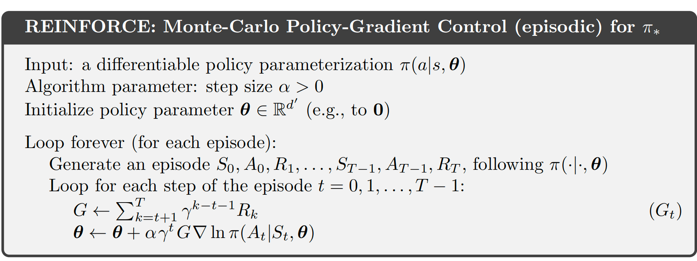
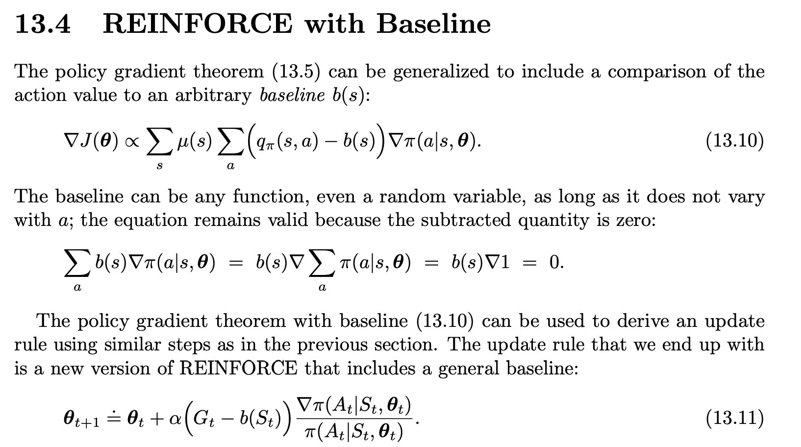
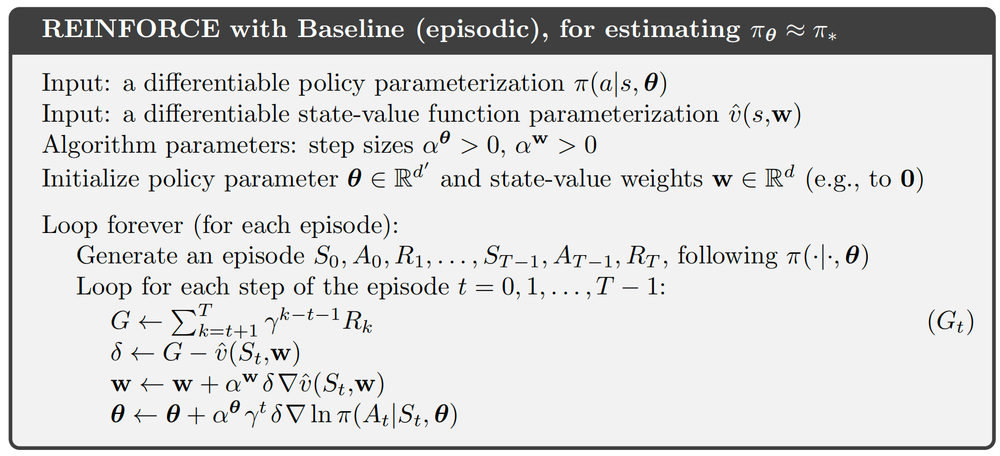

# 1. policy gradient

**论文**

Policy Gradient Methods for Reinforcement Learning with Function Approximation 

 https://proceedings.neurips.cc/paper_files/paper/1999/file/464d828b85b0bed98e80ade0a5c43b0f-Paper.pdf

## 1.1 动机

强化学习（Reinforcement Learning, RL）是一种机器学习方法，它通过智能体与环境的交互来学习最优策略（policy）。强化学习的核心是通过奖励信号来训练智能体，使其在不同的环境状态下采取最优的行动。然而，传统的强化学习算法（如Q-learning）主要适用于离散动作空间，且面临着高维状态和动作空间时，效率和精度可能降低。

**策略梯度（Policy Gradient）算法**是强化学习中的一种方法，旨在解决高维动作空间和连续动作问题，特别适用于那些离散空间方法不适用的问题。通过直接优化智能体的策略函数，而不是值函数，策略梯度方法能够在连续空间和高维度的状态/动作空间中取得较好的效果。

**问题：**

传统强化学习（如Q-learning、SARSA）在解决连续动作空间或高维状态空间问题时面临挑战：

- 值函数方法需维护庞大的Q-table或函数逼近器，离散化操作常常导致过于粗糙的结果。
- 最优策略可能不是确定性的（如π(s)→a），而是需要随机策略（如π(a|s)）

### 1.1.1 为什么最优策略需要随机性？

#### 1.1.1.1 环境不确定性
- **部分可观测性（POMDP）**  
  智能体无法完全感知环境（如传感器噪声），随机策略能覆盖可能的真实状态。
  
- **随机动态环境**  
  环境本身可能具有随机转移（如风力影响机器人），确定性策略可能不稳定。

#### 1.1.1.2 探索与利用的平衡
- **避免局部最优**  
  确定性策略（如Q-learning的`argmax`）可能陷入次优解，随机策略（如ε-greedy）能持续探索。

- **多模态最优解**  
  某些问题存在多个等效最优动作（如迷宫多条路径），随机策略能均匀覆盖，而确定性策略只能选一个。

#### 1.1.1.3 对抗性场景（博弈论）
- **Nash均衡要求随机性**  
  在对抗环境（如扑克、足球点球）中，纯策略（确定性）易被预测，混合策略（随机）才是最优。

- **防止对手利用**  
  随机策略让对手难以预测，提高策略鲁棒性。

#### 1.1.1.4 鲁棒性与泛化性
- **对状态扰动的适应**  
  在连续控制任务中，微小状态变化可能导致确定性策略输出剧烈变化，而随机策略更平滑。

- **泛化到未见状态**  
  在训练未覆盖的状态下，随机策略能提供合理的动作多样性，避免危险行为。

#### 1.1.1.5  数学优化需求
- **策略梯度依赖概率分布**  
  如REINFORCE、PPO等算法需要策略可微，确定性策略（Dirac delta函数）无法计算梯度。

- **熵正则化（如SAC）**  
  鼓励策略保持一定随机性，避免过早收敛到次优解。

---

### 1.1.2 何时确定性策略足够？
- **环境完全确定且可观测**（如解魔方）
- **动作空间低维且离散**（如简单网格世界）
- **训练数据覆盖所有可能状态**（无泛化需求）

> 但现实中，大多数复杂任务（机器人控制、自动驾驶、博弈）都涉及**不确定性、部分观测、对抗交互**，因此**随机策略（π(a|s)）通常更优**。
>
> 

**动机**：
直接参数化策略函数πθ(a|s)，通过梯度上升优化策略性能：

- 避免值函数估计误差传播
- 天然支持随机策略
- 适用于连续动作空间（如机器人控制）

**创新点**：

- **直接策略优化**：直接优化智能体的策略函数，而不是间接通过价值函数进行优化。
- **策略参数化**：能够在高维和连续的动作空间中有效工作，不需要进行动作空间的离散化。
- **梯度理论**：通过梯度下降方法，策略可以逐步调整，使得每次采样都能朝着更好的策略方向发展。

## 1.2 算法过程

策略梯度的核心思想是通过优化策略函数 来最大化期望累积奖励。

目标是最大化智能体的长期奖励。

### 1.2.1公式推导

**目标函数**

期望回报 $J(\theta) = E_{\tau \sim \pi_\theta}[R(\tau)]$，其中 $R(\tau) = \sum_{t=0}^{T} \gamma^t r_t$

梯度推导：

1. 展开期望表达式：
$$
\nabla_\theta J(\theta) = \nabla_\theta \int \pi_\theta(\tau) R(\tau) d\tau
$$

2. 使用对数导数技巧 $\nabla_\theta \pi_\theta = \pi_\theta \nabla_\theta \log \pi_\theta$：

  **对数技巧推导：  **

   $$\nabla_{\theta} \ln P(x|\theta) = \frac{1}{P(x|\theta)} \nabla_{\theta} P(x|\theta)$$ 

   将上式两边乘以 $P(x|\theta)$：$$P(x|\theta) \nabla_{\theta} \log P(x|\theta) = \nabla_{\theta} P(x|\theta)$$
$$
\nabla_\theta J(\theta) = \int \pi_\theta(\tau) \nabla_\theta \log \pi_\theta (\tau) R(\tau) d\tau
$$

3. 分解轨迹概率 $\pi_\theta(\tau) = p(s_0) \prod_{t=0}^{T-1} \pi_\theta(a_t|s_t) p(s_{t+1}|s_t, a_t)$：
$$
\nabla_\theta \log \pi_\theta(\tau) = \sum_{t=0}^{T} \nabla_\theta \log \pi_\theta(a_t|s_t)
$$

4. 最终梯度公式（REINFORCE）：

$$
\nabla_\theta J(\theta) = E_{\tau \sim \pi_\theta} \left[ \left( \sum_{t=0}^{T} \nabla_\theta \log \pi_\theta(a_t|s_t) \right) \left( \sum_{t'=0}^{T} \gamma^{t'} r_{t'} \right) \right]
$$

### 1.2.2 迭代过程

#### 1.2.2.1 Reinforce

#### 1.2.2.1 Reinforce with baseline

##### 1.2.2.1.1 为什么加baseline

**R(τ) 是轨迹 τ 的总回报。如果不使用 baseline，梯度估计完全依赖于 R(τ)，而 R(τ) 的方差可能非常大。**

假设在 CartPole 环境中，初始策略随机向左或向右移动。某次采样中，由于随机性，策略偶然保持平衡很长时间，获得了很高的回报 R(τ)=1000，而大多数轨迹的回报只有 R(τ)=10。此时，梯度更新会过度偏向于这个高回报轨迹的动作，即使这些动作可能只是偶然成功。这会导致策略更新方向不稳定，甚至可能“错误”地强化一些不好的动作。

如果 R(τ) 特别大（比如偶然成功），策略会过度更新 $π_θ(a∣s)$，可能导致 $π_θ(a∣s)$ 接近 1，从而抑制对其他动作的探索。这种过度优化会导致策略崩溃（只选择某个动作）或震荡（因为后续采样可能无法复现高回报）。

**例子**：在 Atari 游戏中，假设初始策略随机选择动作。某次采样中，策略偶然在某个状态 s选择了动作 a（比如“开火”），并恰好击中了敌人，获得了高回报。由于没有 baseline，策略会大幅增加 $π_θ(a∣s)$ 的概率。然而，这个动作可能只是在特定情况下有用（比如敌人恰好处于某个位置），过度优化会导致策略在其他场景中盲目选择“开火”，反而降低整体性能。

##### 1.2.2.1.2 baseline解决的问题

**1. 方差降低**：

- 原始梯度中，G可能很大（尤其是回合累计奖励高的场景），导致梯度幅度波动剧烈。

- 减去基线后，优势函数 A=Q−V 表示的是动作的**相对优势**，其数值范围显著缩小（例如从 [0,1000] 变为 [−50,50]），从而降低方差。

- **高方差带来的训练不稳定**

  - 现象：梯度估计的剧烈波动会导致策略参数更新幅度差异极大，可能出现：
    - 策略突然崩溃（参数更新到无效区域）
    - 收敛速度极慢（需要大量样本平均噪声）

  - **实验对比**：在CartPole任务中，无基线的REINFORCE算法需要10倍以上的训练回合才能达到相同效果。

**2.少采样的动作训练失效**
- **问题本质**：策略梯度依赖于蒙特卡洛采样，若动作 a 被采样的概率 π(a∣s) 很低，其梯度项 $∇_θlogπ_θ(a∣s)Q(s,a)$ 的贡献会被高概率动作主导。
- **具体表现**：
对于稀疏奖励任务，若某个高回报动作初始概率低，可能因采样不足而永远无法被优化。
即使偶然采样到高回报动作，由于 Q(s,a) 的绝对值过大，会导致策略突然偏向该动作（方差放大了偶然性）。

##### 1.2.2.1.3 baseline原则

##### 1.2.2.1.4 算法过程

